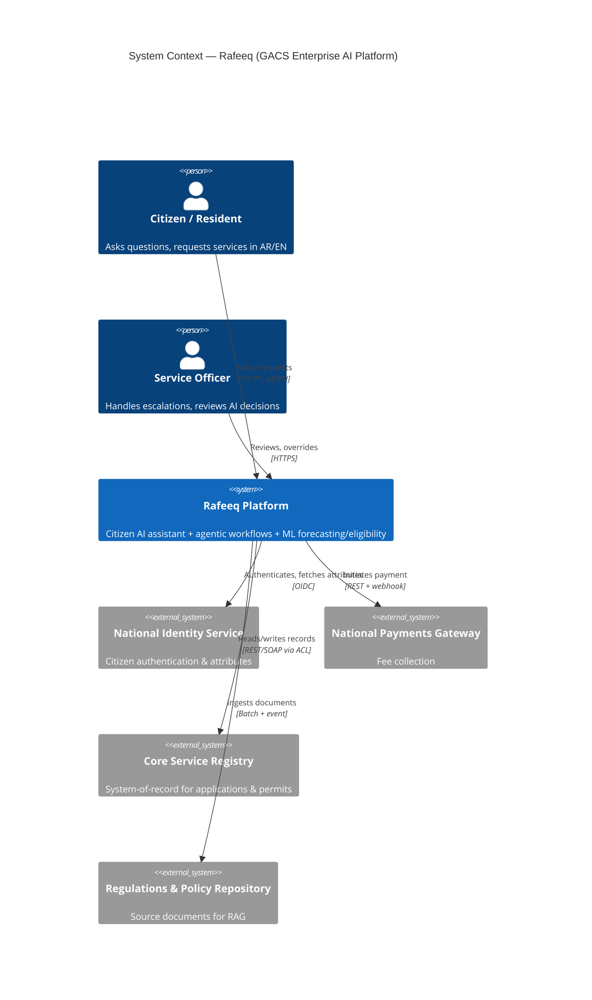
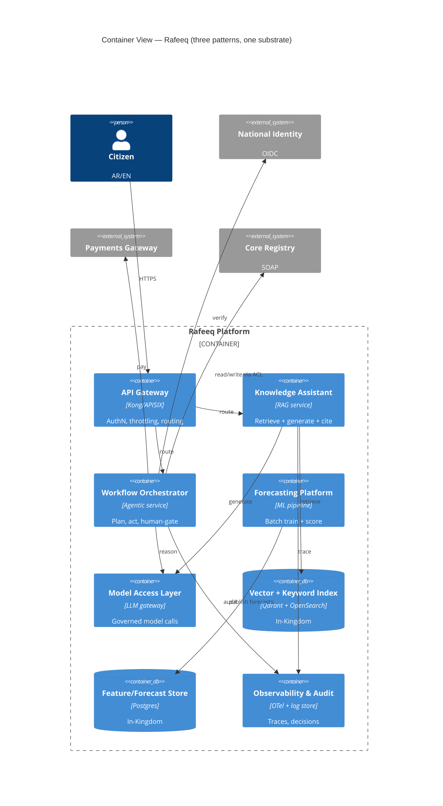
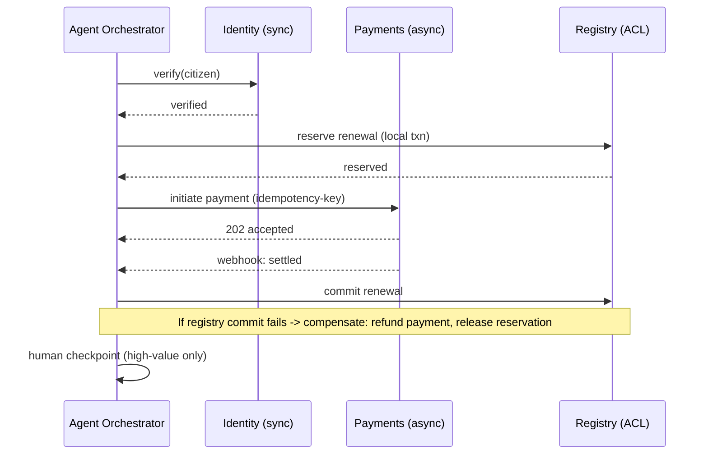
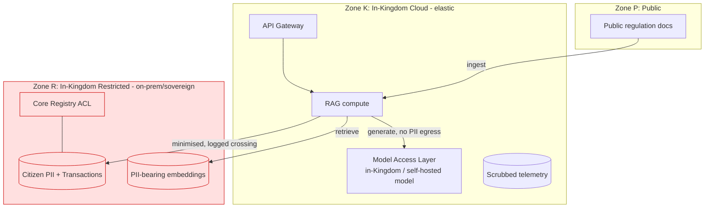

# Enterprise AI Solution Architecture
## معمارية حلول الذكاء الاصطناعي المؤسسية

**Instructor-Ready Training Package — SDAIA Academy**

---

# Cover Page

| Field | Details |
|---|---|
| **Course Title** | Enterprise AI Solution Architecture |
| **Arabic Title** | معمارية حلول الذكاء الاصطناعي المؤسسية |
| **Code** | SDA-AIE-315 |
| **Track** | AI Engineer / مهندس الذكاء الاصطناعي |
| **Level** | Expert / خبير |
| **Duration** | 3 days × 5 learning hours = **15 hours** |
| **Audience** | Senior engineers moving into architecture and technical leadership |
| **Prerequisites** | SDA-AIE-216; SDA-AIE-213 |
| **Assessment** | Architecture design package; peer design review |
| **Stackability** | Architecture badge · Elective for Expert certificate · On-ramp to future AI Solution Architect track · Next: SDA-AIE-390 |
| **Tools & Platforms** | Architecture canvases · C4 modelling · Cloud reference architectures |

## Course Description

An expert module that elevates engineers to solution architects. Participants translate business requirements into end-to-end AI architectures, select platforms and integration patterns, and produce architecture documentation and decision records. Case-based design reviews cover real government and enterprise AI scenarios. Unlike the build-focused modules earlier in the track, this course trades line-by-line implementation for the decisions *above* the code: what to build, where to run it, how it connects, what it must guarantee, and how to defend those choices to a skeptical review board.

The course is built around a single evolving artefact: **Rafeeq (رفيق)**, the enterprise AI platform of a fictional Saudi entity, the **General Authority for Citizen Services (GACS)**. Rafeeq combines a citizen-facing knowledge assistant (RAG over regulations and service policies), an agentic workflow layer that executes government transactions, and an ML platform that forecasts service demand and scores eligibility. Across the three days participants architect Rafeeq end to end — from a one-page business brief in Module 1 to a defended, documented architecture package in Module 7 — reusing the same scenario in every lab so that by the final design-review simulation each participant owns a coherent, sovereignty-compliant reference architecture rather than seven disconnected diagrams.

## Learning Outcomes

By the end of this course, participants will be able to:

1. **LO1** — Translate business requirements into candidate AI solution architectures
2. **LO2** — Design integration patterns connecting AI services to enterprise systems
3. **LO3** — Evaluate platform, cloud, and sovereignty options against constraints
4. **LO4** — Design for security, compliance, and data residency from the outset
5. **LO5** — Develop architecture decision records and reference documentation
6. **LO6** — Defend architectural choices in structured design reviews

---

# Course Delivery Plan

## Day-by-Day Schedule

| Day | Theme | Modules | Theory % | Lab % | Deliverable at End of Day |
|---|---|---|---|---|---|
| **Day 1** | From business need to candidate architecture | M1: AI Solution Architecture Lifecycle · M2: Reference Architectures — RAG, Agents, ML Platforms | 55% | 45% | Architecture brief + context (C4 L1) diagram + chosen reference-architecture skeleton for Rafeeq |
| **Day 2** | Integrating and locating the system | M3: Enterprise Integration and API Strategy · M4: Cloud, On-Premise, and Sovereignty | 50% | 50% | Container (C4 L2) diagram with integration contracts + a scored cloud/on-prem/sovereignty placement decision |
| **Day 3** | Hardening, documenting, defending | M5: Non-Functional Requirements · M6: Architecture Documentation and ADRs · M7: Design-Review Simulations · Capstone | 40% | 60% | Complete architecture package (NFR budget, 5 ADRs, reference doc) + defended design review |

## Hour-by-Hour Breakdown

### Day 1 — From Business Need to Candidate Architecture

| Hour | Session | Learning Objectives | Delivery Mode | Theory/Lab |
|---|---|---|---|---|
| 1 | **What an AI solution architect actually does** + course kickoff + Rafeeq brief | Distinguish the architect role from senior engineer; frame the lifecycle; meet the golden-thread scenario | Interactive lecture + brief walkthrough | 80/20 |
| 2 | **The AI solution architecture lifecycle** (M1) | Requirements → drivers → candidates → evaluation → decision → documentation → review; architecture characteristics; the C4 model | Lecture + live modelling demo | 70/30 |
| 3 | **Lab 1 — From brief to drivers and context** | Extract functional/quality requirements and constraints from the Rafeeq brief; draft the architecture canvas + C4 Level 1 context diagram | Guided lab (pairs) | 15/85 |
| 4 | **Reference architectures for AI** (M2) | RAG, agentic, and ML-platform reference patterns; when each applies; composing them; capability decomposition | Lecture + pattern-catalogue walkthrough | 65/35 |
| 5 | **Lab 2 — Select and compose reference architectures** | Decompose Rafeeq into capabilities; map each to a reference pattern; draw the container-level skeleton | Guided lab (pairs) | 15/85 |

### Day 2 — Integrating and Locating the System

| Hour | Session | Learning Objectives | Delivery Mode | Theory/Lab |
|---|---|---|---|---|
| 1 | **Enterprise integration and API strategy** (M3) | Integration styles (sync/async/event/batch); API gateway, BFF, anti-corruption layer; contracts and versioning; the AI-specific integration hazards | Lecture + integration-map demo | 65/35 |
| 2 | **Lab 3 — Integration architecture** | Map Rafeeq's connections to national identity, payments, core registries; choose styles; define contracts and an anti-corruption layer | Guided lab (pairs) | 10/90 |
| 3 | **Cloud, on-premise, and sovereignty** (M4) | Deployment topologies; Saudi data-residency and cloud-regulatory context (PDPL, CST/NCA, data classification); a placement-decision framework | Lecture + framework demo | 70/30 |
| 4 | **Lab 4 — Sovereign placement decision** | Classify Rafeeq's data domains; score cloud vs on-prem vs hybrid against constraints; write the placement decision with residency zones | Guided lab (pairs) | 15/85 |
| 5 | **Design-review clinic (mid-course)** | Peer critique of Day-1+Day-2 artefacts against a review rubric; surface gaps before hardening | Structured peer review | 20/80 |

### Day 3 — Hardening, Documenting, Defending

| Hour | Session | Learning Objectives | Delivery Mode | Theory/Lab |
|---|---|---|---|---|
| 1 | **Non-functional requirements** (M5) | Security, scale, availability, cost, compliance as measurable budgets; NFR trade-off analysis; AI-specific NFRs (evaluation, drift, guardrails) | Lecture + NFR-budget demo | 60/40 |
| 2 | **Lab 5 — NFR budget + threat model** | Turn Rafeeq's quality attributes into numeric targets; STRIDE-style threat model of one flow; map controls to national frameworks | Guided lab | 15/85 |
| 3 | **Architecture documentation and ADRs** (M6) + **Lab 6** | ADR anatomy; arc42/reference-doc structure; diagrams-as-code; documenting the *why* | Micro-lecture + lab | 30/70 |
| 4 | **M7 — Design-review simulation** + capstone assembly | Run the structured design-review method; assemble the full architecture package | Simulation + project work | 10/90 |
| 5 | **Capstone design-review defence + assessment + wrap-up** | Defend the Rafeeq architecture before a review panel; rubric scoring; path to SDA-AIE-390 | Panel defence | 20/80 |

## Instructor Guidance Notes (Delivery Plan Level)

- **Golden thread:** every module architects the same platform, **Rafeeq** for **GACS**. Never introduce a throwaway example system — always evolve Rafeeq. Each lab adds one layer (drivers → reference patterns → integration → placement → NFRs → ADRs → defence) so the Day-3 capstone is an *assembly and defence*, not a from-scratch scramble.
- **This is a decisions course, not a coding course.** Resist the pull toward implementation. When a participant starts writing application code, redirect to the decision behind it: what characteristic does this serve, what alternative did you reject, where is the ADR? Deliverables are diagrams, canvases, decision tables, ADRs, and defended arguments.
- **Pace control:** Labs 3 (integration) and 4 (sovereignty) overrun most often because participants over-detail. Publish reference artefacts (`rafeeq-brief.md`, `context-c4.md`, a partially filled `integration-map.md`) in the course repository so stragglers can fast-forward and pairs converge on a shared baseline before the mid-course clinic.
- **Pairing:** rotate pairs each day. Pair an infrastructure-strong participant with a modelling/ML-strong participant; architecture quality comes from the collision of both viewpoints.
- **Environment strategy:** minimal tooling — everything is diagrams-as-code and Markdown. Primary = local VS Code + Mermaid preview + a Structurizr/PlantUML renderer; fallback = any browser-based Mermaid live editor. No cloud accounts required; cloud reference architectures are studied as documents, not provisioned.
- **Language:** deliver in English or Arabic; keep all diagram labels, identifiers, ADR text, and file names in English (production convention in Saudi enterprise environments — mixed-language architecture artefacts break tooling and cross-team review). Business context and citizen-facing examples may be bilingual.
- **Sovereignty accuracy:** Module 4 references Saudi data-sovereignty context (PDPL, the Cloud Computing Regulatory Framework, NCA cybersecurity controls, data-classification levels). Where a specific numeric threshold, control ID, or residency rule is not established in the provided source, mark it **"Not specified"** and teach the *reasoning framework* rather than asserting a false fact. Instructors delivering to a specific entity should substitute that entity's actual data-classification policy.
- **Prayer and break scheduling:** each "hour" is 50 minutes of instruction + 10 minutes buffer; schedule the long break around Dhuhr. Day-3 afternoon protects capstone assembly and defence — cut discussion, never build/defence time.
- **Assessment logistics:** the mid-course clinic (Day 2 Hour 5) is formative, not graded; the capstone defence (Day 3 Hour 5) is summative. Collect architecture packages (repository or PDF) at the end of Day 3 Hour 4 so panels can pre-read before defences begin.

---

# Module 1 — AI Solution Architecture Lifecycle

## Module Overview

**Purpose.** An architecture is a set of decisions that are expensive to reverse. This module gives participants a repeatable lifecycle for producing those decisions deliberately rather than by accident: elicit requirements, derive architecture drivers, generate candidate architectures, evaluate them against characteristics, decide, document, and review. It also installs the shared visual language — the C4 model — that the rest of the course and the capstone depend on.

**Business relevance.** In Saudi enterprises and government entities, AI initiatives increasingly fail not at the model but at the seams: a proof-of-concept that cannot pass a security review, integrate with core systems, or run inside the Kingdom's data-residency rules. A disciplined architecture lifecycle is what turns a promising pilot into a fundable, buildable, defensible programme — and it is the difference between an engineer who *has opinions* and an architect who *produces decisions others can act on*.

**Industry use cases.**
- A ministry wants a "citizen AI assistant" (one sentence from the minister). The architect must convert that ambition into drivers, constraints, and a candidate architecture before a single container is provisioned.
- A bank's data-science team has a working eligibility model in a notebook; procurement will not fund production until an architecture package with decision records exists.
- A GovTech vendor bids on a national platform; the winning bid is the one whose architecture demonstrably satisfies stated quality attributes and residency constraints, not the one with the fanciest model.

**Expected competencies.** After this module a participant can run the architecture lifecycle end to end for a bounded scope: extract functional and quality requirements from a business brief, name architecture drivers and characteristics, produce a C4 Level 1 (System Context) diagram, and frame the candidate-and-evaluation step that the remaining modules fill in.

## Learning Objectives (mapped)

| # | Objective | Maps to |
|---|---|---|
| 1.1 | Distinguish the solution-architect role and mandate from a senior-engineer role | LO1 |
| 1.2 | Extract functional requirements, quality attributes, and constraints from a business brief | LO1 |
| 1.3 | Derive architecture drivers and prioritise architecture characteristics | LO1 |
| 1.4 | Produce a System Context (C4 Level 1) diagram for an AI platform | LO1, LO5 |
| 1.5 | Frame candidate architectures and an evaluation approach for later modules | LO1 |

## Technical Content

### 1. What a solution architect produces

A senior engineer answers "how do we build this well?"; a solution architect answers "*what* do we build, *where*, connected to *what*, guaranteeing *what*, and *why not the alternatives*?" The output of architecture work is not code — it is a set of **durable, defensible decisions** captured as diagrams, decision records, and a reference document that a delivery team, a security reviewer, and a funding committee can all act on.

Three properties distinguish an architectural decision from an implementation choice:

- **High cost of change.** Choosing synchronous vs event-driven integration, cloud region vs on-prem, or RAG vs fine-tuning reshapes everything downstream. Choosing a variable name does not.
- **Cross-cutting impact.** The decision constrains multiple teams or components simultaneously.
- **Trade-off density.** There is no free-lunch answer; every option sacrifices something (cost, latency, sovereignty, agility). The architect's job is to make the sacrifice *explicit and chosen* rather than *implicit and discovered in production*.

**Instructor note:** open with the question "who here has seen a working model that never reached production?" — every hand goes up. The postmortem is almost always architectural (integration, compliance, cost, operability), not statistical. That gap is this course.

### 2. The architecture lifecycle

The course uses a seven-step lifecycle. It is iterative, not waterfall — later steps routinely send you back — but the *order of first pass* matters:

| Step | Question answered | Primary artefact | Course home |
|---|---|---|---|
| 1. Requirements & context | What must it do and for whom? | Requirements list, context brief | M1 |
| 2. Architecture drivers | What forces shape the design? | Drivers + prioritised characteristics | M1 |
| 3. Candidate architectures | What are our realistic options? | Reference-pattern selection | M2 |
| 4. Integration & placement | How does it connect and where does it run? | Integration map, placement decision | M3, M4 |
| 5. NFR & risk hardening | What must it guarantee, and what can go wrong? | NFR budget, threat model | M5 |
| 6. Documentation | How do we record the *why*? | ADRs, reference document | M6 |
| 7. Review & defence | Is it sound, and can we defend it? | Design-review record | M7 |

The lifecycle maps one-to-one onto the seven modules — this is deliberate, so the mental model and the syllabus reinforce each other.

### 3. Requirements: functional, quality, constraint

Architects sort every requirement into three buckets, because each drives design differently:

- **Functional requirements** — what the system does ("answer citizen questions about visa rules", "execute a permit-renewal transaction"). These shape *components*.
- **Quality attributes / non-functional requirements** — how well it must do it ("p95 answer latency < 3 s", "99.5% availability", "no citizen PII leaves the Kingdom"). These shape *characteristics* and dominate architecture. A system that does the right thing too slowly, too expensively, or non-compliantly has failed architecturally.
- **Constraints** — non-negotiable givens ("must integrate with the existing national identity service", "must run in an approved in-Kingdom region", "budget ceiling", "go-live before the next Hajj season"). Constraints *remove* options; naming them early prevents wasted design.

The classic architecture mistake is to elicit only functional requirements — the ones stakeholders volunteer — and to *discover* the quality attributes and constraints in production. The architect's first act is to drag them into the light.

### 4. Architecture drivers and characteristics

**Architecture drivers** are the small set of forces — usually 5–9 — that genuinely shape the design. They are distilled from the requirements and constraints. For Rafeeq they include: strict data residency, citizen-facing latency, integration with legacy core registries, auditability of AI decisions, cost sensitivity of a public-sector budget, and the need to evolve models without re-integrating.

**Architecture characteristics** (the "-ilities") are the quality attributes you consciously optimise for. You cannot maximise all of them — optimising availability, security, and cost simultaneously is a contradiction — so the architect *prioritises*. A useful discipline: force stakeholders to pick the **top 3–5** characteristics; everything else is "satisfied, not optimised."

| Characteristic | Rafeeq relevance | Tension with |
|---|---|---|
| Security & data residency | Citizen PII, sovereignty | Cost, agility, latency |
| Availability | Citizen-facing public service | Cost, simplicity |
| Auditability | AI decisions on entitlements | Latency, storage cost |
| Evolvability | Swap/upgrade models frequently | Simplicity, delivery speed |
| Cost efficiency | Public budget | Availability, performance |
| Performance (latency) | Interactive assistant | Cost, accuracy (larger models) |

Naming the tensions is the point. "We optimise for security, auditability, and availability; we satisfy cost and latency within budget" is an architectural stance you can defend. "It should be secure and fast and cheap" is a wish.

### 5. The C4 model as the shared language

The course standardises on the **C4 model** (Context, Containers, Components, Code) because it gives every diagram a defined altitude and audience, and because it is diagram-as-code friendly:

- **Level 1 — System Context:** the system as one box, surrounded by users and external systems. Audience: everyone, including non-technical stakeholders. Produced in M1.
- **Level 2 — Containers:** the major deployable/runnable units (the RAG service, the agent orchestrator, the vector store, the API gateway) and how they talk. Audience: architects and engineers. Produced in M2–M3.
- **Level 3 — Components:** the internals of one container. Used sparingly, only where it earns its keep.
- **Level 4 — Code:** rarely drawn; generated if needed.

The discipline C4 enforces: **choose an altitude and stay at it.** The most common diagram failure in review is altitude-mixing — a box labelled "Kubernetes" next to a box labelled "the reranking function" in the same picture. C4 forbids it.

### 6. Common mistakes & real-world example

**Common mistakes (each seeded into Lab 1's brief)**
1. Eliciting only functional requirements; discovering residency and integration constraints during build.
2. Optimising every characteristic ("make it all good") — no prioritisation, so no design guidance.
3. Jumping to a technology ("we'll use vector DB X") before the drivers justify it — *solution-first* instead of *driver-first*.
4. Drawing a "boxes-and-arrows" diagram with no altitude — mixing infrastructure, components, and data flows.
5. Treating the model as the architecture; ignoring the 90% of the system that is integration, data, and operations.
6. No named decision — a diagram with no record of *why* it looks that way, so the first reviewer's question is unanswerable.

**Real-world example (narrate, 5 min).** A Gulf government entity commissioned a "smart assistant" as a chatbot pilot. It demoed beautifully. Twelve months later it was cancelled — not because the model was wrong, but because (a) it had been built on a foreign SaaS with no in-Kingdom data path, failing residency review; (b) it could not reach the core registry (no integration design); and (c) nobody could say who owned the answers it gave on entitlements (no auditability). Every one of those is an architecture-lifecycle omission from Step 1–2. This course is that omission, corrected.

## Code Examples

Architecture work is expressed as diagrams-as-code and structured decision artefacts. These are the "code" of this course.

### System Context (C4 Level 1) as Mermaid



### Architecture drivers, captured as a structured table

```yaml
# artefacts/rafeeq/drivers.yaml — one source of truth for what shapes the design
platform: Rafeeq
owner: General Authority for Citizen Services (GACS)
drivers:
  - id: DR-01
    name: Data residency
    statement: "All citizen personal data must remain in an approved in-Kingdom region."
    source: constraint            # constraint | quality | functional
    impacts: [placement, integration, vendor-selection]
  - id: DR-02
    name: Citizen-facing latency
    statement: "Assistant answers within p95 < 3s to feel interactive."
    source: quality
    impacts: [reference-architecture, serving, model-selection]
  - id: DR-03
    name: Legacy integration
    statement: "Must read/write the SOAP-era Core Service Registry without modifying it."
    source: constraint
    impacts: [integration, anti-corruption-layer]
  - id: DR-04
    name: Decision auditability
    statement: "Every AI-influenced entitlement decision must be explainable and logged for audit."
    source: quality
    impacts: [nfr, documentation, guardrails]
  - id: DR-05
    name: Model evolvability
    statement: "Models and prompts change monthly without re-integrating consumers."
    source: quality
    impacts: [api-strategy, reference-architecture]
prioritised_characteristics: [security_residency, auditability, availability]   # top 3, defended
satisfied_not_optimised: [cost, latency, simplicity]
```

### Requirements triage snippet

```yaml
# artefacts/rafeeq/requirements.yaml
functional:
  - "Answer citizen questions grounded in current regulations (RAG)."
  - "Execute permit-renewal end to end, including payment (agentic workflow)."
  - "Forecast weekly service-centre demand per region (ML platform)."
quality_attributes:
  - id: QA-01 { attribute: security,   target: "No PII egress from KSA; PDPL-aligned" }
  - id: QA-02 { attribute: performance, target: "p95 assistant answer < 3s" }
  - id: QA-03 { attribute: availability, target: "99.5% monthly for citizen channel" }
  - id: QA-04 { attribute: auditability, target: "100% of entitlement decisions logged w/ rationale" }
constraints:
  - "In-Kingdom hosting in an approved region (see M4)."
  - "Integrate with existing IAM, Payments, and Core Registry — no changes to registry."
  - "Public-sector budget ceiling (value: Not specified)."
```

## Hands-on Lab 1 — From Brief to Drivers and Context

| | |
|---|---|
| **Objective** | Convert the one-page Rafeeq business brief into a triaged requirements list, a prioritised set of architecture drivers/characteristics, an architecture canvas, and a C4 Level 1 System Context diagram |
| **Duration** | 50 minutes |
| **Setup** | VS Code + Mermaid preview extension; course repo cloned; open `briefs/rafeeq-brief.md` and `templates/architecture-canvas.md` |

**Instructions & tasks**

1. *(8 min)* Read `rafeeq-brief.md` (a realistic, deliberately incomplete minister's-ambition brief). Highlight every sentence and tag it `[F]` functional, `[Q]` quality, or `[C]` constraint. Note what is *missing* — the brief omits residency and auditability explicitly; you must surface them.
2. *(12 min)* Fill `requirements.yaml`: at least 3 functional, 4 quality attributes (each with a measurable target), 3 constraints. Where the brief is silent on a target, write `Not specified` and flag it as a stakeholder question.
3. *(12 min)* Derive `drivers.yaml`: 5–7 drivers with IDs, source type, and `impacts`. Then force a decision — pick the **top 3** prioritised characteristics and list what you consciously de-prioritise.
4. *(13 min)* Draw the System Context in Mermaid (`context-c4.md`) with the platform as one box, the users, and the four external systems. Every relationship gets a label and a protocol.
5. *(5 min)* Complete the one-page architecture canvas (drivers, characteristics, top risks, open questions). Commit: `docs(m1): rafeeq requirements, drivers, and system context`.

**Expected output**
```
artefacts/rafeeq/
  requirements.yaml     # 3F / 4Q / 3C, targets or "Not specified"
  drivers.yaml          # 5-7 drivers, top-3 characteristics chosen
  context-c4.md         # renders to a clean C4-L1 diagram
  architecture-canvas.md
```
A peer can read the canvas in 2 minutes and correctly state what Rafeeq optimises for and why.

**Acceptance criteria**
- Exactly one system box at Level 1 (no altitude mixing).
- Every quality attribute has a target or an explicit `Not specified` + owner question.
- Prioritised characteristics number 3–5, with de-prioritised ones named.

**Troubleshooting guidance**

| Symptom | Cause | Fix |
|---|---|---|
| Diagram has 12 boxes | Slid to container level | Collapse internals; Level 1 is one system box + externals only |
| "Everything is a priority" | No forced trade-off | Facilitate the pick-3; ask "if you could keep only three, which?" |
| Requirements are all functional | Only elicited what stakeholders volunteered | Prompt for residency, audit, availability explicitly |
| Drivers restate requirements verbatim | Not distilled | A driver is a *force*; group requirements into 5–9 shaping forces |

**Instructor notes.** The brief hides two constraints (residency, no-registry-modification) inside prose — walk the room and see who surfaces them. Fast finishers: draft one *candidate* sentence per capability ("assistant = RAG; renewal = agent; forecast = ML platform") — a perfect bridge to Module 2.

## Mini Exercises

1. **Classify (5 items):** For each — "answers must cite the source regulation", "must run in-Kingdom", "p95 < 3s", "swap the LLM monthly", "integrate with SOAP registry" — label F/Q/C and name the characteristic it drives.
2. **Altitude check:** Given six diagram boxes (`Vector DB`, `reranker function`, `Kubernetes cluster`, `Citizen`, `Payments Gateway`, `RAG service`), sort them into C4 levels; identify which two must never share a diagram.
3. **Trade-off framing:** Write one sentence in the form "We optimise for X, Y, Z; we satisfy A, B within constraint C" for a hospital triage-assist system.
4. **Missing constraint hunt:** Read a 4-sentence "build us a chatbot" brief; list three constraints a stakeholder failed to state.
5. **Driver distillation:** Reduce a list of 14 requirements to 6 architecture drivers.

## Case Study — The Ministry Chatbot That Passed the Demo and Failed the Review

**Scenario.** A large government entity ("the Authority") commissions a citizen assistant. A vendor delivers a polished pilot in eight weeks on a foreign LLM SaaS. The minister demos it; it answers beautifully in Arabic and English. Funding for production is expected to be a formality.

**Business context.** The production go/no-go passes through an architecture and security review board. The board's mandate is national-scale, sovereignty-compliant public services — not demos.

**Technical challenge.** The pilot has no architecture package: no drivers, no context diagram, no integration design, no placement decision, no auditability story. It was built solution-first.

**Constraints.** Citizen PII cannot leave the Kingdom; the assistant must eventually act on real entitlements (not just chat); the Authority's core registry is a legacy SOAP system that cannot be modified.

**Solution approach (facilitate, don't lecture).** Restart at Step 1 of the lifecycle: elicit the hidden quality attributes (residency, auditability) and constraints (legacy integration); name drivers; produce a context diagram that makes the external systems and data flows explicit; only then choose a candidate architecture (Module 2) that keeps PII in-Kingdom. The pilot's model may survive; its architecture does not.

**Discussion questions.**
1. Which lifecycle steps did the vendor skip, and what did each omission cost?
2. Is the demo a sunk cost or an asset? What, specifically, is reusable?
3. The vendor argues "the model works, integration is just plumbing." Rebut this with the drivers.
4. Who on the Authority's side should have owned Step 1, and when?

## Benchmarks and Evaluation

| Metric | Category | Target after M1 | How measured |
|---|---|---|---|
| Requirements triaged into F/Q/C | Completeness | 100% of brief sentences tagged | Review of `requirements.yaml` |
| Quality attributes with measurable targets | Rigour | ≥ 4, each numeric or explicit "Not specified" | Canvas review |
| Prioritised characteristics | Decisiveness | 3–5 chosen, de-prioritised named | Canvas review |
| C4 altitude purity (Level 1) | Diagram quality | 1 system box, 0 internal components shown | Diagram review |
| Hidden constraints surfaced | Elicitation quality | ≥ 2 of the 2 planted found | Instructor checklist |
| Time for a peer to state "what it optimises for" | Communicability | < 2 min from canvas | Pair exercise |

**Example benchmark table (filled during lab):**

| Artefact | Before (raw brief) | After (Lab 1) |
|---|---|---|
| Named quality attributes | 1 ("smart") | 4 (measurable) |
| Named constraints | 0 explicit | 3 (2 were hidden) |
| Architecture drivers | 0 | 6 |
| Diagram altitude | mixed / none | clean Level 1 |

## Required Visuals and Training Assets

### Diagrams
1. **The architecture lifecycle wheel** — *Purpose:* anchor image for the whole course. *Elements:* seven-step iterative cycle (requirements → drivers → candidates → integration/placement → NFR/risk → documentation → review) with module numbers on each step and back-arrows showing iteration. *Style:* circular flow, 7 colour-coded segments, English labels with Arabic subtitles. *Designer description:* "Circular seven-segment wheel, each segment a lifecycle step with an icon and module tag, curved back-arrows between non-adjacent steps to show iteration."
2. **C4 altitude ladder** — *Purpose:* teach staying at one altitude. *Elements:* four stacked frames (Context / Container / Component / Code) with the same Rafeeq system shown at each zoom level and a "you are here" marker at Level 1. *Style:* zoom-in stack, printable A4.
3. **Requirements triage funnel** — *Purpose:* motivate F/Q/C separation. *Elements:* raw brief sentences entering a funnel, splitting into three streams (functional→components, quality→characteristics, constraints→removed options). *Style:* funnel with three coloured outputs.
4. **Rafeeq System Context** — *Purpose:* reference exemplar. *Elements:* the finished C4-L1 from the code example, rendered cleanly. *Style:* official C4 palette.

### Images (screenshots)
1. **Architecture canvas — filled example**: *why:* participants mirror it in Lab 1; *content:* one-page canvas with drivers, top-3 characteristics, risks, open questions.
2. **Mermaid preview in VS Code**: *why:* tooling literacy; *content:* `context-c4.md` source on the left, rendered diagram on the right.
3. **Before/after requirements table**: *why:* makes elicitation gains measurable; *content:* the benchmark table above.

### Simulations
1. **The hidden-constraint brief** — *Setup:* `briefs/rafeeq-brief.md` buries residency and no-modify-registry constraints in prose. *Expected behaviour:* pairs that read only for functionality miss them and are caught at the mid-course clinic. *Learning objective:* constraints are elicited, not volunteered.
2. **Altitude-mixing trap** — *Setup:* a provided "draft" context diagram that sneaks a vector DB and a Kubernetes node onto Level 1. *Expected behaviour:* participants must demote both. *Learning objective:* one altitude per diagram.

### Interactive Activities
- **Pick-3 characteristics auction (10 min):** each pair is given a budget of 3 "priority tokens" to place on characteristic cards; forced scarcity produces a defensible stance.
- **F/Q/C card sort (10 min):** 15 requirement cards sorted onto three floor zones; disputed cards spark the best discussions.

### Datasets
| Dataset | Source | Format | Size | Purpose |
|---|---|---|---|---|
| `rafeeq-brief.md` | Course-authored, GACS scenario | Markdown | 1 page | Lab 1 elicitation; reused all modules |
| `stakeholder-quotes.md` | Course-authored | Markdown | 12 quotes | Extract implied quality attributes |
| `architecture-canvas.md` | Template | Markdown | 1 page | Canvas fill exercise |

### Demo Requirements
- **Instructor demo:** live, from `rafeeq-brief.md` to a clean C4-L1 in under 8 minutes — narrate the F/Q/C tagging aloud; the speed and the *thinking-aloud* are the message.
- **Student demo:** one pair presents its top-3 characteristics and defends the de-prioritised two at end of Hour 3.
- **Expected outputs:** committed `requirements.yaml`, `drivers.yaml`, `context-c4.md`, `architecture-canvas.md`.

---

# Module 2 — Reference Architectures: RAG, Agents, and ML Platforms

## Module Overview

**Purpose.** Architects do not invent from scratch; they select and compose proven **reference architectures** and adapt them to drivers. This module builds a working catalogue of the three AI reference patterns Rafeeq needs — retrieval-augmented generation (RAG), agentic systems, and classical ML platforms — with a decision framework for when each applies, and teaches capability decomposition so a monolithic ambition becomes a set of well-chosen patterns.

**Business relevance.** The most common architecture failure in AI programmes is *pattern mismatch*: building an agent where a RAG answer would do, fine-tuning where retrieval suffices, or bolting an LLM onto a problem that is really a forecasting model. Each mismatch multiplies cost, latency, and risk. In the Saudi public sector, where budgets and audit scrutiny are high, choosing the *right* pattern per capability is a direct fiduciary and compliance responsibility.

**Industry use cases.**
- A knowledge assistant grounded in current regulations — a textbook RAG use case; fine-tuning would bake in stale rules.
- A permit-renewal workflow that must call identity, payment, and registry systems in sequence with human checkpoints — an agentic pattern with guardrails, not a chat model.
- Regional demand forecasting for staffing service centres — a classical ML platform (feature store, batch training, scheduled scoring); an LLM here is malpractice.

**Expected competencies.** Participants can decompose a platform into capabilities, select a reference architecture per capability with an explicit rationale, identify the shared platform substrate the patterns rely on, and produce a container-level (C4 L2) skeleton that composes them coherently.

## Learning Objectives (mapped)

| # | Objective | Maps to |
|---|---|---|
| 2.1 | Decompose an enterprise AI platform into distinct capabilities | LO1 |
| 2.2 | Select RAG, agentic, or ML-platform reference architectures per capability with rationale | LO1, LO2 |
| 2.3 | Identify the shared substrate (gateway, model access, data, observability) across patterns | LO2 |
| 2.4 | Compose multiple patterns into one coherent container-level architecture | LO1, LO2 |
| 2.5 | Justify pattern choice against drivers and reject mismatched alternatives | LO1, LO6 |

## Technical Content

### 1. Capability decomposition

Before choosing patterns, split the platform into **capabilities** — cohesive units of value with distinct data, latency, and correctness profiles. Rafeeq decomposes into three:

| Capability | Nature | Latency profile | Correctness stakes | Natural pattern |
|---|---|---|---|---|
| **Knowledge assistant** | Answer questions from documents | Interactive (< 3 s) | Grounded, cite-able | RAG |
| **Service transactions** | Execute multi-step gov workflows | Seconds–minutes, human-gated | High — acts on entitlements | Agentic + guardrails |
| **Demand forecasting** | Predict service-centre load | Batch (daily/weekly) | Statistical, monitorable | ML platform |

The discipline: **one capability, one primary pattern.** Blurring them ("one big agent that also forecasts and answers") is the anti-pattern that destroys evolvability and auditability.

### 2. Reference architecture A — RAG

A production RAG reference architecture has stable components regardless of vendor:

- **Ingestion & indexing pipeline:** source connectors → parsing → chunking → embedding → vector index (+ keyword index for hybrid). Runs as a batch/event pipeline, *not* in the request path.
- **Retrieval stack:** query understanding → hybrid retrieval (vector + keyword) → reranking → context assembly.
- **Generation:** an LLM constrained by retrieved context, with citation grounding and a refusal path when confidence is low.
- **Evaluation harness:** faithfulness, answer-relevance, and context-precision metrics run continuously (offline eval + online sampling).

Architectural decisions the pattern forces: where embeddings and the vector index live (residency — Module 4); freshness SLA of the index vs the source repository; and the refusal policy (a citizen assistant that confidently invents a regulation is worse than one that says "I can't confirm that").

### 3. Reference architecture B — Agentic systems

The agentic pattern applies when the system must *take actions* across tools, not just answer. Its reference components:

- **Orchestrator / planner:** decomposes a goal ("renew this permit") into steps.
- **Tool/skill layer:** typed, permissioned connectors to identity, payment, registry — each an integration contract (Module 3).
- **State & memory:** short-term working state per transaction; long-term memory where justified.
- **Guardrails & human-in-the-loop:** policy checks before any state-changing action; mandatory human checkpoints for high-stakes steps (e.g., approving a payment).
- **Trace & audit:** every step, tool call, and decision logged — non-negotiable for entitlement actions.

Architectural stance for the public sector: agents that change government records must be **constrained, auditable, and reversible**, never autonomously final. The architecture makes the human checkpoint a first-class component, not an afterthought.

### 4. Reference architecture C — ML platform

The classical ML-platform pattern (from SDA-AIE-216) serves the forecasting capability:

- **Feature pipeline & store:** historical demand, calendar/Hijri events, regional attributes.
- **Training pipeline:** scheduled retraining, experiment tracking, model registry.
- **Serving:** batch scoring (forecasts published to a store the staffing system reads); no low-latency online path needed.
- **Monitoring:** data drift, forecast error tracking, retraining triggers.

The architect's value here is *restraint*: recognising this capability needs none of the LLM machinery, and keeping it a boring, reliable, cheap ML pipeline.

### 5. The shared substrate

The three patterns are not islands — they share a platform substrate, and *seeing the shared substrate is the architectural insight of this module*:

| Shared concern | Serves | Why shared |
|---|---|---|
| **API gateway** | All external consumers | One entry, one auth, one throttle point (Module 3) |
| **Model access layer** | RAG + agents | One governed path to LLMs; swap models without touching consumers (evolvability driver DR-05) |
| **Identity & authorisation** | All capabilities | One integration with national IAM |
| **Data & residency zone** | All | One sovereignty boundary (Module 4) |
| **Observability & audit** | All | One trace/audit backbone (Modules 5–6) |

Composing patterns onto a shared substrate — rather than three siloed stacks — is what makes Rafeeq one *platform* instead of three projects.

### 6. Common mistakes & real-world example

**Common mistakes**
1. **Pattern inflation:** using an agent where a single RAG call suffices — 5× the cost and latency, more failure modes.
2. **LLM-for-everything:** forcing forecasting through a chat model instead of a regression pipeline.
3. **Fine-tune reflex:** fine-tuning to inject knowledge that changes monthly, where RAG is correct (couples freshness to a training cycle).
4. **No shared substrate:** three teams build three gateways, three model paths, three audit logs — the "platform" is a fiction.
5. **Ignoring the ingestion pipeline:** treating RAG as "just the query side" and discovering the index is stale in production.
6. **Autonomous action:** an agent that finalises entitlements without a human checkpoint — an audit and trust catastrophe.

**Real-world example (narrate).** A regional programme built "one agent to rule them all" for citizen services. It answered questions (slowly, via tool calls that were really retrieval), executed transactions, and even produced reports. Cost per interaction was 6× a comparable RAG answer; a single prompt change could break a transaction flow; and auditors could not separate "answered a question" from "changed a record". The rescue architecture split it into three capabilities on a shared substrate — the exact decomposition this module teaches.

## Code Examples

### Container view (C4 Level 2) composing the three patterns



### Pattern-selection decision table (a reusable artefact)

```yaml
# artefacts/rafeeq/pattern-selection.yaml
capabilities:
  - id: CAP-01
    name: Knowledge assistant
    chosen_pattern: RAG
    rationale: >
      Knowledge changes monthly (DR-05) -> retrieval keeps answers fresh without
      retraining; citations satisfy auditability (DR-04); interactive latency (DR-02) achievable.
    rejected:
      - option: Fine-tuning
        why: "Bakes in stale regulations; opaque provenance; violates freshness + audit drivers."
      - option: Agentic
        why: "No state-changing actions needed; pattern inflation raises cost/latency."
  - id: CAP-02
    name: Service transactions
    chosen_pattern: Agentic + guardrails + human-in-the-loop
    rationale: "Multi-step actions across IAM/Payments/Registry; must be auditable & reversible."
    rejected:
      - option: RAG
        why: "Cannot take actions."
      - option: Hard-coded workflow
        why: "Considered — viable fallback; agent chosen for flexible multi-service orchestration, but see ADR-002 trade-off."
  - id: CAP-03
    name: Demand forecasting
    chosen_pattern: Classical ML platform (batch)
    rationale: "Statistical time-series problem; batch latency fine; cheap, monitorable."
    rejected:
      - option: LLM
        why: "Wrong tool; unreliable numbers, high cost, no drift monitoring story."
shared_substrate: [api_gateway, model_access_layer, identity, residency_zone, observability_audit]
```

## Hands-on Lab 2 — Select and Compose Reference Architectures

| | |
|---|---|
| **Objective** | Decompose Rafeeq into capabilities, select a reference architecture per capability with written rationale and rejected alternatives, and draw a C4 Level 2 container skeleton composing them on a shared substrate |
| **Duration** | 50 minutes |
| **Setup** | Lab 1 artefacts; open `templates/pattern-selection.yaml` and `catalogues/reference-patterns.md` (RAG/agent/ML reference cards) |

**Instructions & tasks**
1. *(8 min)* Confirm the three capabilities from Lab 1's requirements; write a one-line nature/latency/stakes profile for each.
2. *(15 min)* Fill `pattern-selection.yaml`: for each capability, the chosen pattern, a rationale that cites a driver ID, and **at least one rejected alternative with a reason**. The rejected-alternatives are graded — a choice without rejected options is not an architectural decision.
3. *(15 min)* Draw the C4 L2 container view (`container-c4.md`): show the three capability services plus the shared substrate (gateway, model access layer, indexes/stores, observability). Every relationship labelled.
4. *(7 min)* Mark the residency-sensitive containers (vector index, feature store, model access) — these become Module 4 inputs.
5. *(5 min)* Commit: `docs(m2): pattern selection and container skeleton for rafeeq`.

**Expected output**
```
artefacts/rafeeq/
  pattern-selection.yaml   # 3 capabilities, each with rationale + >=1 rejected option
  container-c4.md          # renders clean C4-L2 with shared substrate visible
```

**Acceptance criteria**
- Each capability has exactly one primary pattern.
- Every choice cites at least one driver ID and rejects at least one alternative.
- The shared substrate (gateway, model access, observability) appears once, not per-capability.

**Troubleshooting guidance**

| Symptom | Cause | Fix |
|---|---|---|
| Forecasting drawn as an LLM service | LLM-for-everything reflex | Ask: does this need language? It needs regression — demote to ML pipeline |
| Three separate gateways/model paths | No shared-substrate thinking | Consolidate; the platform has one entry and one governed model path |
| "Agent" chosen with no rejected option | Choice, not decision | Require a rejected alternative with a driver-linked reason |
| Diagram mixes L1 externals with L3 functions | Altitude drift | Keep to container granularity |

**Instructor notes.** The highest-value moment is catching pattern inflation — someone will make the assistant an "agent". Let it happen, then compare cost/latency on the whiteboard against a plain RAG call. Fast finishers: sketch the RAG ingestion pipeline as its own mini-diagram (foreshadows the freshness NFR in M5).

## Mini Exercises

1. **Pattern match:** For five capabilities (contract summarisation, appointment booking with payment, spam classification, policy Q&A, anomaly alerting), name the reference pattern and one rejected alternative.
2. **Inflation hunt:** Given a diagram where every box is an "agent", identify which two should be plain RAG or a function call.
3. **Substrate spotting:** List every component that three sibling AI services could share instead of duplicating.
4. **Freshness SLA:** Propose an index-refresh policy for a regulation repository updated weekly; justify the lag you accept.
5. **Restraint case:** Argue in three sentences why the forecasting capability should *not* use an LLM.

## Case Study — "One Agent to Rule Them All" at a National Services Programme

**Scenario.** A national programme proudly ships a single large agent that answers citizen questions, executes transactions, and generates management reports. Leadership loves the simplicity of "one AI".

**Business context.** Interaction cost is 6× a comparable retrieval answer; the monthly regulation update requires prompt surgery that occasionally breaks a transaction flow; auditors cannot distinguish an informational answer from a record-changing action.

**Technical challenge.** Re-architect into distinct capabilities without a big-bang rewrite, preserving the shared identity and audit integrations.

**Constraints.** Zero downtime for the citizen channel; the transaction flows touch real entitlements and cannot regress; the reporting function is used in a weekly executive meeting and cannot pause.

**Solution approach (facilitate).** Decompose into knowledge-assistant (RAG), transactions (agent + guardrails), and reporting (a scheduled ML/analytics job) on a shared substrate; migrate the cheapest, lowest-risk capability (Q&A → RAG) first to prove the substrate; keep the agent only for genuine multi-step actions; introduce the human-in-the-loop checkpoint the monolith lacked.

**Discussion questions.**
1. Which capability do you carve out first, and why that one?
2. What does the shared substrate let you *not* rebuild three times?
3. How do you prove to auditors that "answered a question" and "changed a record" are now separable?
4. When, if ever, is a single-agent design actually correct?

## Benchmarks and Evaluation

| Metric | Category | Target after M2 | How measured |
|---|---|---|---|
| Capabilities identified | Decomposition | ≥ 3, non-overlapping | Review |
| Pattern choices with rationale + rejected option | Decision quality | 100% | `pattern-selection.yaml` review |
| Driver linkage | Traceability | Every choice cites ≥ 1 driver ID | Review |
| Shared-substrate components | Platform coherence | Gateway/model-access/observability each appear once | Diagram review |
| Pattern-mismatch flags | Correctness | 0 (no LLM-for-forecast, no agent-for-Q&A) | Instructor checklist |
| C4-L2 altitude purity | Diagram quality | Container granularity only | Review |

**Example benchmark table:**

| Design | Cost/interaction (rel.) | Failure modes | Auditable actions |
|---|---|---|---|
| Single mega-agent | 6× | Many (one prompt breaks all) | Blurred |
| Composed patterns + substrate | 1× baseline | Isolated per capability | Cleanly separated |

## Required Visuals and Training Assets

### Diagrams
1. **Reference-pattern catalogue card set** — *Purpose:* reusable pattern library. *Elements:* three cards (RAG, Agentic, ML platform), each with components, "use when", "don't use when", key decisions. *Style:* card deck, printable.
2. **Rafeeq container view** — *Purpose:* reference exemplar. *Elements:* the C4-L2 from the code example. *Style:* C4 palette, residency-sensitive containers highlighted.
3. **Capability-to-pattern map** — *Purpose:* show decomposition logic. *Elements:* three capability boxes → arrows → chosen patterns, with rejected patterns greyed. *Style:* mapping diagram.
4. **Shared-substrate layer cake** — *Purpose:* make the platform-not-projects idea visible. *Elements:* three capability columns sitting on shared substrate layers. *Style:* layered stack.

### Images
1. **Rendered container diagram**: *why:* target output; *content:* clean C4-L2.
2. **Pattern-selection YAML with rejected options**: *why:* what "a decision" looks like; *content:* filled example.
3. **Cost comparison chart**: *why:* motivates restraint; *content:* mega-agent vs composed bar chart.

### Simulations
1. **Pattern-inflation trap** — *Setup:* a provided draft that models Q&A as an agent. *Expected:* participants demote it to RAG and quantify the saving. *Learning objective:* pattern fit over pattern fashion.
2. **Stale-index incident** — *Setup:* a scenario where the RAG index lags the regulation repo by six weeks. *Expected:* participants add an ingestion freshness SLA. *Learning objective:* RAG is a pipeline, not just a query.

### Interactive Activities
- **Capability card sort (12 min):** teams sort ten capabilities onto pattern zones; contested cards drive discussion.
- **Substrate consolidation (10 min):** given three siloed stack drawings, teams merge shared components onto one substrate.

### Datasets
| Dataset | Source | Format | Size | Purpose |
|---|---|---|---|---|
| `reference-patterns.md` | Course-authored catalogue | Markdown | 3 cards | Pattern selection reference |
| `capability-inventory.md` | Course-authored | Markdown | 10 items | Decomposition exercise |

### Demo Requirements
- **Instructor demo:** live decomposition of Rafeeq into three capabilities and a container skeleton in 8 minutes, thinking aloud about each rejected alternative.
- **Student demo:** one pair defends why forecasting is *not* an LLM problem.
- **Expected outputs:** committed `pattern-selection.yaml`, `container-c4.md`.

---

# Module 3 — Enterprise Integration and API Strategy

## Module Overview

**Purpose.** An enterprise AI platform is mostly integration. This module teaches participants to design how Rafeeq connects to the systems around it — identity, payments, legacy registries, document sources — using the right integration style per connection, protecting the platform from legacy chaos with an anti-corruption layer, and exposing a clean, versioned API strategy to its own consumers.

**Business relevance.** In Saudi government and enterprise estates, the AI system is the *newest* thing in a landscape of decades-old core systems. The architecture succeeds or fails at the seams: a synchronous call to a flaky SOAP registry can take down the citizen channel; an unbounded coupling to a legacy schema freezes the platform's ability to evolve. API strategy is also where multi-consumer governance (mobile app, web, partner entities) and rate-limiting for cost control live.

**Industry use cases.**
- A permit renewal that must call identity (sync), take payment (async with webhook), and update a legacy registry (via an anti-corruption layer) — three different integration styles in one flow.
- A document-ingestion pipeline that consumes regulation updates via events rather than polling, keeping the RAG index fresh.
- An internal LLM gateway exposing one versioned contract to five consuming teams, each rate-limited and audited independently.

**Expected competencies.** Participants can choose integration styles (sync/async/event/batch) per connection with justification, design an anti-corruption layer around a legacy system, define API contracts and a versioning/deprecation strategy, and place the gateway/BFF concerns correctly.

## Learning Objectives (mapped)

| # | Objective | Maps to |
|---|---|---|
| 3.1 | Choose an integration style per connection with explicit trade-offs | LO2 |
| 3.2 | Design an anti-corruption layer isolating the platform from legacy systems | LO2 |
| 3.3 | Define API contracts, versioning, and deprecation policy | LO2, LO5 |
| 3.4 | Position gateway, BFF, and event-broker concerns correctly | LO2 |
| 3.5 | Identify and mitigate AI-specific integration hazards | LO2, LO4 |

## Technical Content

### 1. Integration styles and when to use each

Every connection is one of four styles; choosing wrong is a top cause of production fragility:

| Style | Use when | Rafeeq example | Risk if misused |
|---|---|---|---|
| **Synchronous request/response** | Caller needs an answer now; dependency is fast & reliable | Verify citizen identity before acting | Couples your uptime to theirs; cascading failure |
| **Asynchronous request + callback/webhook** | Operation is slow or external-paced | Payment initiation → webhook on settlement | Lost callbacks; needs idempotency + reconciliation |
| **Event-driven (pub/sub)** | Loose coupling; many consumers; eventual consistency OK | Regulation updated → re-index event | Ordering/duplication; harder to reason about |
| **Batch** | High volume, latency-tolerant | Nightly bulk document ingestion | Staleness; big-bang failure blast radius |

The architect's rule: **default to the loosest coupling the requirement allows.** Synchronous is the tightest and should be *earned*, not assumed. A citizen-channel that synchronously depends on a legacy registry inherits the registry's worst day.

### 2. The anti-corruption layer (ACL)

The Core Service Registry is a legacy SOAP system with a gnarly schema the platform must not absorb. The **anti-corruption layer** is a translation boundary: it speaks the legacy system's language on one side and the platform's clean domain model on the other, so legacy concepts never leak inward.

- **Why it matters:** without an ACL, the registry's field names, quirks, and failure modes propagate through the codebase; the day the registry is replaced, the whole platform changes. With an ACL, that day changes one component.
- **What lives in it:** protocol translation (SOAP↔REST/domain), schema mapping, retry/circuit-breaker policy, and *semantic* translation (legacy status codes → domain decisions).
- **Where it sits:** an adapter component owned by the platform, at the edge — the same "frameworks live at the edge" discipline from the engineering track, applied to whole external systems.

### 3. API strategy for the platform's own consumers

Rafeeq is not only a consumer; it is a *provider* to a mobile app, a web portal, and possibly partner entities. The API strategy:

- **One gateway, one front door:** authentication, authorisation, rate limiting, and routing centralised. Per-consumer quotas are also a *cost* control (LLM calls are not free).
- **Backend-for-frontend (BFF) where consumers diverge:** a mobile BFF and a web BFF can shape responses per channel without forking the core services.
- **Contract-first:** publish OpenAPI (REST) / AsyncAPI (events) contracts; consumers build against the contract, not the implementation.
- **Versioning:** URI versioning (`/v1/`) for visibility; additive changes are free, breaking changes get a new version; deprecate with `Deprecation`/`Sunset` headers and consumer comms; delete only at zero traffic.
- **Stable error envelope:** one error shape with machine-readable `code`, human `message`, and `trace_id` — so every consumer writes one error handler.

### 4. AI-specific integration hazards

AI systems introduce integration hazards classical systems do not:

- **Non-determinism at the boundary:** the same input can yield different outputs. Contracts must specify *shape and constraints*, not exact values; consumers must not hard-code on generated text.
- **Latency variance:** LLM calls have fat-tailed latency. Synchronous flows need timeouts, fallbacks, and a "degrade to human" path — never an unbounded wait in the citizen channel.
- **Prompt-injection through integration:** content pulled from external systems (documents, registry fields) can carry injected instructions into an LLM. The integration layer is a *trust boundary* — sanitise and label untrusted content (links to Module 5).
- **Cost as a runtime dependency:** each downstream LLM call costs money; unbounded fan-out (an agent that loops) is a financial DoS. Rate limits and budgets are architectural, not operational afterthoughts.
- **Idempotency for actions:** an agent retrying a "make payment" step must not pay twice; idempotency keys are mandatory on state-changing integrations.

### 5. Consistency and the transaction problem

Government transactions span systems that cannot share a database transaction (identity, payment, registry). The architect must choose a consistency strategy:

- **Saga pattern:** a sequence of local transactions with compensating actions (if payment succeeds but registry write fails, refund). Rafeeq's permit-renewal is a saga.
- **Outbox pattern:** reliably emit events after a local commit, avoiding dual-write inconsistency.
- **Human checkpoint as a consistency tool:** for high-stakes steps, a human confirmation is both a guardrail *and* a synchronisation point.

The lesson: distributed government workflows are *eventually consistent with compensation*, not ACID. Designing the compensations up front is the architecture; discovering their absence is the incident.

### 6. Common mistakes & real-world example

**Common mistakes**
1. Synchronous-everything — coupling the citizen channel to the slowest legacy dependency.
2. No anti-corruption layer — legacy schema metastasises through the platform.
3. Contract-after — building the implementation then documenting whatever it happened to do.
4. Breaking changes shipped in place — silently breaking consumers instead of versioning.
5. No idempotency on actions — double payments on retry.
6. Trusting external content into an LLM — prompt injection via a registry field or ingested document.

**Real-world example (narrate).** An entity integrated its new assistant *synchronously* with a legacy registry to "keep it simple". The registry had a weekly maintenance window; every window, the citizen assistant returned 500s for hours, because a *read* for context blocked on the registry. The fix was architectural: cache the needed reference data, make the registry call asynchronous with a fallback, and wrap it in an ACL with a circuit breaker. Latency-coupling to legacy is a design decision people make by *not* deciding.

## Code Examples

### Integration map with per-connection style and contract

```yaml
# artefacts/rafeeq/integration-map.yaml
integrations:
  - id: INT-IAM
    system: National Identity Service
    direction: outbound
    style: synchronous
    protocol: OIDC / REST
    rationale: "Identity must be verified before any action; provider is fast & HA."
    resilience: { timeout_ms: 800, retries: 1, circuit_breaker: true, fallback: "deny + human" }
    trust: external_authenticated
  - id: INT-PAY
    system: National Payments Gateway
    direction: outbound
    style: async_with_webhook
    protocol: REST + signed webhook
    rationale: "Settlement is external-paced; do not block the flow."
    resilience: { idempotency_key: required, reconciliation: "nightly", webhook_verify: hmac }
    trust: external_authenticated
  - id: INT-REG
    system: Core Service Registry (legacy SOAP)
    direction: bidirectional
    style: synchronous_via_ACL
    protocol: SOAP behind anti-corruption layer
    rationale: "System of record; wrap to isolate legacy schema & failure modes."
    resilience: { timeout_ms: 1500, circuit_breaker: true, cache_reference_data: true }
    trust: internal_untrusted_content   # fields may carry injected text -> sanitise
  - id: INT-DOCS
    system: Regulations & Policy Repository
    direction: inbound
    style: event_driven
    protocol: AsyncAPI (doc.updated events) + batch backfill
    rationale: "Keep RAG index fresh without polling; many-consumer friendly."
    resilience: { dedupe: true, ordering: per_document }
    trust: internal_untrusted_content
```

### Saga for permit renewal (mermaid sequence with compensation)



### API versioning & deprecation policy (contract excerpt)

```yaml
# artefacts/rafeeq/api-policy.yaml
versioning:
  scheme: uri            # /v1/, /v2/
  additive_changes: allowed_in_place       # new optional fields
  breaking_changes: new_version_required   # removed/renamed field, tightened validation, changed semantics
deprecation:
  signal_headers: [Deprecation, Sunset]
  min_notice: "Not specified (set per consumer SLA; recommend >= 2 release cycles)"
  delete_when: "traffic_to_version == 0"
error_envelope:
  shape: { error: { code: string, message: string, trace_id: string } }
  codes_are_stable_contract: true
rate_limiting:
  per_consumer: true
  purpose: [protection, cost_control]
```

## Hands-on Lab 3 — Integration Architecture

| | |
|---|---|
| **Objective** | Design Rafeeq's integration architecture: choose a style per external connection with resilience policy, design the anti-corruption layer around the legacy registry, define the saga for permit renewal, and set the API/versioning policy |
| **Duration** | 50 minutes |
| **Setup** | Lab 2 artefacts; open `templates/integration-map.yaml`, `catalogues/integration-styles.md`; the legacy registry's quirks are described in `systems/core-registry.md` |

**Instructions & tasks**
1. *(12 min)* Fill `integration-map.yaml` for the four external systems (identity, payments, registry, documents). Each entry: style, protocol, rationale citing a driver, resilience policy, and trust classification.
2. *(12 min)* Design the ACL around the Core Registry: list what it translates (protocol, schema, semantics), and its resilience (timeout, circuit breaker, reference-data cache). Draw it as a boundary component on the container diagram.
3. *(12 min)* Draw the permit-renewal saga (`saga-renewal.md`) with at least one compensating action and one human checkpoint; mark the idempotent step.
4. *(9 min)* Fill `api-policy.yaml`: versioning scheme, additive-vs-breaking rules, deprecation signalling, error envelope, per-consumer rate limiting (mark unknown notice periods `Not specified`).
5. *(5 min)* Commit: `docs(m3): integration map, ACL, saga, and API policy`.

**Expected output**
```
artefacts/rafeeq/
  integration-map.yaml   # 4 connections, style + resilience + trust each
  saga-renewal.md        # sequence with compensation + human checkpoint
  api-policy.yaml         # versioning + deprecation + error envelope
```

**Acceptance criteria**
- No external dependency in the citizen path is unbounded-synchronous without a fallback.
- The legacy registry is reached only through the ACL.
- The saga has explicit compensation for the payment-succeeds/registry-fails case.
- Every state-changing integration marks idempotency.

**Troubleshooting guidance**

| Symptom | Cause | Fix |
|---|---|---|
| Everything is synchronous | Default-to-tight-coupling | Justify each sync call; loosen where latency allows |
| Registry called directly from the agent | Missing ACL | Route through the ACL boundary; legacy stays quarantined |
| Saga has no compensation | Happy-path only | Add the failure branch: what undoes a partial transaction? |
| Payment can double on retry | No idempotency | Add idempotency key to the payment integration |

**Instructor notes.** The synchronous-registry trap is the teachable moment — most pairs will couple the citizen path to the legacy read. Surface one example on the projector and walk the maintenance-window failure. Fast finishers: define the AsyncAPI event schema for `doc.updated` (bridges to the RAG freshness NFR).

## Mini Exercises

1. **Style selection:** For five connections (send SMS, read reference table, notify partner of status, bulk import 2M records, verify identity), pick a style and one risk.
2. **ACL scope:** List four things an anti-corruption layer around a legacy HR system should translate.
3. **Idempotency:** Explain why a retried "create application" must be idempotent and how to make it so.
4. **Injection boundary:** Name two integration points where external content could carry a prompt injection into Rafeeq.
5. **Deprecation drill:** Write the header sequence and comms steps to retire `/v1/predict` in favour of `/v2/`.

## Case Study — The Weekly Outage Caused by a "Simple" Integration

**Scenario.** A citizen assistant returns errors every Friday morning. Investigation shows a synchronous read to a legacy registry — used to fetch reference data for context — blocking during the registry's weekly maintenance window.

**Business context.** The outage hits the public channel during a peak period; complaints reach leadership; the AI programme's credibility is questioned for a reason that has nothing to do with AI.

**Technical challenge.** Decouple the platform from the legacy maintenance window without losing the reference data the assistant needs.

**Constraints.** The registry cannot be modified or its window moved; reference data changes rarely but must not be stale beyond a day; no downtime for the fix rollout.

**Solution approach (facilitate).** Introduce an ACL with a circuit breaker; cache the slow-changing reference data with a daily refresh; make the registry read asynchronous/cached in the request path with a fallback to cached data during the window; add an alert if cache age exceeds the freshness SLA.

**Discussion questions.**
1. Why did "keep it simple" (direct sync) create fragility?
2. What is the acceptable staleness for the cached reference data, and who decides?
3. How does the ACL change the blast radius of the *next* legacy change?
4. Which driver did the original design violate?

## Benchmarks and Evaluation

| Metric | Category | Target after M3 | How measured |
|---|---|---|---|
| Connections with justified style | Design quality | 100% cite a driver + risk | `integration-map.yaml` review |
| Unbounded sync deps in citizen path | Resilience | 0 (all have fallback/timeout) | Review |
| Legacy access via ACL | Isolation | 100% | Diagram review |
| State-changing integrations with idempotency | Correctness | 100% | Review |
| Saga compensation coverage | Consistency | ≥ 1 compensating action per failure branch | Sequence review |
| Trust classification on inbound content | Security | 100% of external content labelled | Review |

**Example benchmark table:**

| Design | Citizen-channel coupling to legacy | Double-payment risk | Legacy-change blast radius |
|---|---|---|---|
| Direct sync, no ACL | High (inherits window) | Present | Whole platform |
| ACL + cache + async + idempotency | Isolated | Eliminated | One component |

## Required Visuals and Training Assets

### Diagrams
1. **Integration-style decision tree** — *Purpose:* pick the right style fast. *Elements:* branches on "need answer now?", "external-paced?", "many consumers?", "high volume?" → sync/async/event/batch leaves. *Style:* compact flowchart, printable.
2. **Anti-corruption layer boundary** — *Purpose:* make the isolation visible. *Elements:* messy legacy system on one side, clean domain on the other, ACL translating protocol/schema/semantics between. *Style:* boundary panel with translation callouts.
3. **Permit-renewal saga** — *Purpose:* teach compensation. *Elements:* the sequence diagram with the compensation branch highlighted in red. *Style:* sequence diagram.
4. **API strategy layer** — *Purpose:* gateway/BFF/contract picture. *Elements:* consumers → gateway (auth/throttle) → BFFs → core services; contracts as documents at the boundary. *Style:* layered.

### Images
1. **Integration map YAML**: *why:* target artefact; *content:* the filled example.
2. **Rendered saga with compensation**: *why:* consistency literacy; *content:* the mermaid sequence.
3. **Circuit-breaker state screenshot (conceptual)**: *why:* resilience mechanism; *content:* closed/open/half-open states around the ACL.

### Simulations
1. **Maintenance-window outage** — *Setup:* a scenario branch where a sync legacy read has a weekly window. *Expected:* participants decouple via ACL + cache. *Learning objective:* earn synchronous coupling; default loose.
2. **Double-payment on retry** — *Setup:* a saga without idempotency; a retried payment step. *Expected:* participants add idempotency keys and reconciliation. *Learning objective:* actions must be idempotent.

### Interactive Activities
- **Style-sort relay (10 min):** connection cards sorted onto four style zones under a stopwatch; disputed cards debated.
- **ACL role-play (12 min):** one participant is the legacy system speaking "SOAP-ese"; the ACL translates to a clean domain request live.

### Datasets
| Dataset | Source | Format | Size | Purpose |
|---|---|---|---|---|
| `core-registry.md` | Course-authored legacy spec | Markdown | 1 page | ACL design input (deliberately gnarly) |
| `integration-styles.md` | Course-authored catalogue | Markdown | 4 cards | Style selection reference |
| `consumer-list.md` | Course-authored | Markdown | 5 consumers | API/BFF exercise |

### Demo Requirements
- **Instructor demo:** live design of the permit-renewal saga including the compensation branch in 8 minutes.
- **Student demo:** one pair defends why their registry integration is asynchronous/cached, not direct sync.
- **Expected outputs:** committed `integration-map.yaml`, `saga-renewal.md`, `api-policy.yaml`.

---

# Module 4 — Cloud, On-Premise, and Sovereignty Considerations

## Module Overview

**Purpose.** Where a system runs is an architectural decision with legal, financial, and operational weight. This module gives participants a defensible framework for placing Rafeeq's workloads across cloud, on-premise, and hybrid topologies under Saudi data-sovereignty constraints — classifying data, mapping residency zones, and scoring placement options against drivers rather than vendor preference or fashion.

**Business relevance.** For Saudi government and regulated enterprises, sovereignty is not optional. Personal data of citizens, and certain classified government data, are subject to residency and control requirements. An architecture that ignores this fails review no matter how elegant. Equally, an architecture that over-restricts (everything on-prem "to be safe") wastes budget and forfeits cloud elasticity that citizen-facing load genuinely needs. The architect's job is the *right* placement per data domain, defensibly argued.

> **Instructor accuracy note.** Saudi regulatory instruments referenced here — the Personal Data Protection Law (PDPL) and its regulations, the Cloud Computing Regulatory Framework, National Cybersecurity Authority (NCA) controls, and government data-classification levels — evolve and contain specifics that are entity- and version-dependent. Where an exact threshold, control identifier, hosting rule, or classification boundary is **not established in the provided course source, mark it "Not specified"** and teach the reasoning framework. Substitute the delivering entity's actual current policy in live delivery.

**Industry use cases.**
- A citizen assistant whose PII-bearing components must remain in an approved in-Kingdom region while stateless compute can burst elastically.
- A hybrid design where the model-access layer runs in an in-Kingdom cloud region but the most sensitive registry data never leaves an on-prem enclave.
- A vendor-selection decision gated on whether a provider offers a compliant in-Kingdom region and the required control attestations.

**Expected competencies.** Participants can classify data domains, map each to a residency requirement, evaluate cloud vs on-prem vs hybrid against a scored framework, design residency zones and their crossing rules, and document the placement decision with its trade-offs.

## Learning Objectives (mapped)

| # | Objective | Maps to |
|---|---|---|
| 4.1 | Classify data domains by sensitivity and residency requirement | LO3, LO4 |
| 4.2 | Compare cloud, on-premise, and hybrid topologies against drivers | LO3 |
| 4.3 | Design residency zones and data-crossing rules for an AI platform | LO3, LO4 |
| 4.4 | Evaluate providers/platforms against sovereignty and control constraints | LO3 |
| 4.5 | Produce a scored, documented placement decision | LO3, LO5 |

## Technical Content

### 1. Data classification as the foundation

Placement follows classification, not the other way round. The architect first partitions the platform's data into domains and classifies each:

| Data domain (Rafeeq) | Example | Sensitivity | Residency requirement |
|---|---|---|---|
| Citizen PII | National ID, contact, entitlements | High | In-Kingdom, restricted (PDPL) |
| Transaction records | Permit applications, payments | High | In-Kingdom, system-of-record |
| Regulations & policies | Public source documents | Low / public | No residency constraint |
| Derived embeddings | Vectors of documents | Depends on source | Inherits source sensitivity |
| Operational telemetry | Traces, metrics (scrubbed) | Medium | Prefer in-Kingdom; scrub PII |
| Model artefacts / prompts | Fine-tuned weights, system prompts | Medium–High | May encode sensitive terminology |

Two subtle points worth class time: **embeddings inherit the sensitivity of their source** — a vector of a citizen record is still personal data; and **prompts/model artefacts can leak sensitive internal terminology**, so they are not automatically "just config". Government data-classification schemes (e.g., levels analogous to Top Secret / Secret / Restricted / Public) map onto these domains; the exact level names and rules are **Not specified** here and must be taken from the entity's policy.

### 2. Deployment topologies

| Topology | Strengths | Weaknesses | Fits when |
|---|---|---|---|
| **Public cloud (in-Kingdom region)** | Elastic, managed services, fast delivery, cost-efficient at variable load | Requires an approved region + control attestations; shared-responsibility discipline | Citizen-facing, bursty, non-highest-classification workloads |
| **On-premise / private government cloud** | Maximum control, suits highest classification, air-gap possible | Capex, slower elasticity, ops burden, GPU scarcity | Highest-sensitivity data; strict control mandates |
| **Hybrid** | Place each workload where it belongs; keep the crown jewels close | Integration + residency-crossing complexity; two operating models | Mixed classification (Rafeeq's real case) |
| **Edge** | Low latency, local processing | Limited, hard to secure/operate at scale | Rarely for this platform |

The default architectural stance for a mixed-classification government platform is **hybrid**: stateless, elastic, lower-classification compute in an approved in-Kingdom cloud region; highest-classification data and systems-of-record in an on-prem/private enclave; explicit, minimal, audited crossings between them.

### 3. Residency zones and crossing rules

The architect draws **residency zones** on the container diagram and defines what may cross each boundary:

- **Zone R (Restricted, in-Kingdom, tight control):** citizen PII, transaction records, PII-bearing embeddings. On-prem or approved sovereign region.
- **Zone K (In-Kingdom cloud):** stateless services, model-access layer, scrubbed telemetry, public-document index.
- **Zone P (Public/low-sensitivity):** public regulation documents pre-ingestion.
- **Crossing rules:** data leaving Zone R is minimised, tokenised/pseudonymised where possible, logged, and never exported outside the Kingdom. No PII crosses to any out-of-Kingdom endpoint (including foreign LLM APIs) — this single rule frequently dictates the model-access design (in-Kingdom-hosted or on-prem models, or strict de-identification before any external call).

The **model-access decision** is where sovereignty bites hardest: if no PII may leave the Kingdom and the best models are foreign-hosted, options are (a) in-Kingdom-hosted managed models, (b) self-hosted open-weight models in Zone K/R, or (c) rigorous de-identification before external calls (fragile, often insufficient for citizen data). The choice is an ADR (Module 6).

### 4. The placement-decision framework

Placement is scored, not asserted. The framework:

1. **List data domains and classifications** (Section 1).
2. **List candidate topologies** per capability.
3. **Score each option** against weighted drivers (residency compliance is usually a *gate*, not a score — fail it and the option is out regardless of other merits).
4. **Record the decision** with the score table and the rejected options.

Residency compliance as a **gate** is the key discipline: a cheaper, faster option that fails residency is not a trade-off — it is disqualified. Cost and latency compete only *among compliant* options.

### 5. Shared responsibility and provider evaluation

Cloud does not outsource accountability. The **shared-responsibility model** must be explicit: the provider secures the infrastructure; the entity remains accountable for data classification, access control, encryption configuration, and compliance. Provider evaluation criteria for a sovereign context:

- Approved in-Kingdom region availability for the needed services (including GPU/model services).
- Control attestations / certifications acceptable to the entity's regulator (specific certs: **Not specified** — use the entity's approved list).
- Data-processing and residency contractual terms; key management (customer-managed keys where required).
- Exit strategy and portability (avoid lock-in that becomes a sovereignty trap).

### 6. Common mistakes & real-world example

**Common mistakes**
1. Placement before classification — deciding "cloud" or "on-prem" before knowing what data flows where.
2. Treating residency as a score to trade off against cost, instead of a gate.
3. Forgetting embeddings/telemetry/prompts inherit sensitivity — "we only sent vectors" is not a defence for PII.
4. Sending citizen data to a foreign-hosted LLM "just for the pilot".
5. Over-restriction — everything on-prem, forfeiting elasticity the citizen channel needs and blowing the budget.
6. Assuming cloud = compliant, or on-prem = secure, without the control work either requires.

**Real-world example (narrate).** A promising assistant pilot was built on a foreign LLM SaaS; citizen queries — containing names and ID numbers — were sent abroad for inference. It failed residency review outright and could not be remediated by patching, because residency had never been a design input. The rebuild put a self-hosted open-weight model in an in-Kingdom zone and de-identified the little that had to cross any boundary. The cost of retrofitting sovereignty was a full re-architecture; the cost of designing it in would have been one ADR.

## Code Examples

### Data-classification and residency map

```yaml
# artefacts/rafeeq/residency-map.yaml
data_domains:
  - id: D-PII
    name: Citizen PII
    classification: restricted        # entity scheme level: Not specified
    residency: in_kingdom_restricted
    zone: R
  - id: D-TXN
    name: Transaction records
    classification: restricted
    residency: in_kingdom_restricted
    zone: R
  - id: D-EMB
    name: Document embeddings
    classification: inherits_source
    residency: "in_kingdom if source is PII/restricted else in_kingdom_cloud"
    zone: R_or_K
  - id: D-DOCS
    name: Public regulations
    classification: public
    residency: none
    zone: P
  - id: D-TELE
    name: Operational telemetry (PII-scrubbed)
    classification: medium
    residency: prefer_in_kingdom
    zone: K
crossing_rules:
  - "No PII leaves the Kingdom, including to external model APIs."
  - "Data leaving Zone R is minimised, pseudonymised where feasible, and logged."
  - "Model-access layer must not transmit Zone R content to out-of-Kingdom endpoints."
```

### Placement scoring (residency as a gate)

```yaml
# artefacts/rafeeq/placement-decision.yaml
capability: Knowledge assistant (RAG)
options:
  - name: Foreign LLM SaaS
    residency_gate: FAIL          # PII in queries would egress -> disqualified
    note: "Rejected regardless of cost/quality."
  - name: In-Kingdom managed cloud region + hosted model
    residency_gate: PASS
    scores: { cost: 4, latency: 4, elasticity: 5, control: 3, delivery_speed: 5 }  # 1-5
  - name: On-prem self-hosted open-weight model
    residency_gate: PASS
    scores: { cost: 2, latency: 4, elasticity: 2, control: 5, delivery_speed: 2 }
weights: { control: 0.30, cost: 0.20, elasticity: 0.20, latency: 0.15, delivery_speed: 0.15 }
decision: >
  Hybrid: stateless RAG compute + model-access in in-Kingdom cloud (Zone K);
  PII-bearing indexes in Zone R. Foreign SaaS gated out on residency.
recorded_as: ADR-003
```

### Residency zones on the deployment diagram



## Hands-on Lab 4 — Sovereign Placement Decision

| | |
|---|---|
| **Objective** | Classify Rafeeq's data domains, map residency zones and crossing rules, score cloud vs on-prem vs hybrid with residency as a gate, and write the placement decision that becomes ADR-003 |
| **Duration** | 50 minutes |
| **Setup** | Lab 2–3 artefacts; open `templates/residency-map.yaml`, `templates/placement-decision.yaml`, and `refs/sovereignty-context.md` (a primer with clearly-marked "Not specified" fields) |

**Instructions & tasks**
1. *(10 min)* Fill `residency-map.yaml`: classify at least five data domains; assign each a zone; explicitly note that embeddings inherit source sensitivity. Mark any regulatory specific you cannot verify `Not specified`.
2. *(12 min)* Write crossing rules: what may leave Zone R, under what conditions; the no-PII-egress rule; the model-access constraint.
3. *(13 min)* Fill `placement-decision.yaml` for the RAG capability: list ≥ 3 options, apply the **residency gate** (fail the foreign-SaaS option), score the surviving options against weighted drivers, and state the hybrid decision.
4. *(10 min)* Update the deployment diagram (`deployment-zones.md`) showing Zones R/K/P and the minimal crossings; highlight the model-access decision.
5. *(5 min)* Commit: `docs(m4): residency map, crossing rules, and placement decision`.

**Expected output**
```
artefacts/rafeeq/
  residency-map.yaml       # >=5 domains classified + zoned
  placement-decision.yaml  # residency gate applied; scored survivors; hybrid decision
  deployment-zones.md      # R/K/P zones with crossing arrows
```

**Acceptance criteria**
- At least one option is *gated out* on residency (not merely scored low).
- Embeddings and telemetry are correctly classified (not assumed non-sensitive).
- No PII-bearing flow crosses out of the Kingdom, including to model APIs.
- Every unverifiable regulatory specific is marked `Not specified`.

**Troubleshooting guidance**

| Symptom | Cause | Fix |
|---|---|---|
| Foreign SaaS "wins on cost" | Residency treated as a score | Residency is a gate; disqualify non-compliant options first |
| Embeddings placed in public zone | Forgot inheritance | Embeddings of PII are PII; move to Zone R |
| Everything on-prem | Over-restriction | Separate by classification; elastic low-sensitivity compute can be in-Kingdom cloud |
| Confident regulatory numbers | Fabricated specifics | Replace with `Not specified` + entity-policy pointer |

**Instructor notes.** The single most important teachable moment is the residency **gate**: watch for pairs that build a neat weighted score and let a non-compliant option win on cost — stop and reframe compliance as a gate. Emphasise the "Not specified" discipline; a confidently wrong regulatory claim in an architecture package is worse than an honest gap. Fast finishers: draft the model-access ADR skeleton (self-hosted vs in-Kingdom managed) — a direct Module 6 input.

## Mini Exercises

1. **Classify & zone:** Assign zones to: citizen phone number, public FAQ text, a fine-tuned model, request latency metrics, a permit record.
2. **Gate vs score:** Explain in two sentences why residency compliance is a gate, not a weighted criterion.
3. **Inheritance:** Argue why an embedding of a citizen record cannot sit in the public zone.
4. **Model-access dilemma:** List three ways to satisfy "no PII to a foreign model" and a downside of each.
5. **Over-restriction:** Give one workload that is safe and beneficial to place in an in-Kingdom cloud rather than on-prem, and why.

## Case Study — The Pilot That Sent Citizen Data Abroad

**Scenario.** An enthusiastic team ships a citizen assistant pilot on a foreign LLM SaaS in six weeks. Queries containing names and national ID numbers are sent out of the Kingdom for inference. The pilot is a hit — until the sovereignty review.

**Business context.** The review board blocks production. The issue is not fixable by configuration because residency was never a design input; the data path is foreign by construction.

**Technical challenge.** Re-architect so that no citizen data leaves the Kingdom while preserving answer quality and interactive latency.

**Constraints.** Approved in-Kingdom regions have a narrower managed-model catalogue; GPU capacity on-prem is limited; the go-live date has already been announced.

**Solution approach (facilitate).** Classify data; define Zone R for PII and PII-bearing embeddings; place model-access as a self-hosted open-weight model in an in-Kingdom zone (or an approved in-Kingdom managed model); de-identify the minimal data that must cross any boundary; record the model-access decision as an ADR with the quality/cost trade-off stated honestly.

**Discussion questions.**
1. Why could the pilot not be "patched" into compliance?
2. What did designing residency in from Module 1 have avoided?
3. How do you defend a possibly-smaller in-Kingdom model against "but the foreign one scores higher"?
4. What is the exit/portability risk of the compliant choice, and how do you mitigate it?

## Benchmarks and Evaluation

| Metric | Category | Target after M4 | How measured |
|---|---|---|---|
| Data domains classified & zoned | Completeness | ≥ 5, embeddings/telemetry included | `residency-map.yaml` review |
| Options gated on residency | Rigour | ≥ 1 disqualified before scoring | `placement-decision.yaml` review |
| PII egress paths | Compliance | 0 (including to model APIs) | Diagram + rules review |
| Crossing rules defined | Control | Explicit R-exit conditions present | Review |
| Unverified specifics handling | Integrity | 100% marked "Not specified" | Instructor checklist |
| Placement decision documented | Traceability | Scored table + rejected options + ADR pointer | Review |

**Example benchmark table:**

| Design | PII egress | Residency review | Elasticity | Relative cost |
|---|---|---|---|---|
| Foreign SaaS pilot | Yes | Fail | High | Low |
| All on-prem | No | Pass | Low | High |
| Hybrid (Zone R + Zone K) | No | Pass | High (K) | Moderate |

## Required Visuals and Training Assets

### Diagrams
1. **Data-classification-to-zone map** — *Purpose:* placement follows classification. *Elements:* data domains → classification levels → residency zones, with embeddings shown inheriting source sensitivity. *Style:* mapping diagram; "Not specified" tags where regulatory specifics are unverified.
2. **Residency zones deployment view** — *Purpose:* reference exemplar. *Elements:* Zones P/K/R with minimal, labelled crossings; model-access decision highlighted. *Style:* the mermaid flowchart, rendered.
3. **Placement decision funnel** — *Purpose:* gate-then-score discipline. *Elements:* options entering a residency gate (fails drop out), survivors scored. *Style:* funnel with a gate.
4. **Shared-responsibility split** — *Purpose:* cloud ≠ outsourced accountability. *Elements:* provider-secured vs entity-accountable columns. *Style:* two-column table graphic.

### Images
1. **Residency map YAML**: *why:* target artefact; *content:* filled example with a "Not specified" field visible.
2. **Placement scoring table**: *why:* gate-then-score in action; *content:* the disqualified option greyed out.
3. **Zones deployment diagram rendered**: *why:* the module's anchor; *content:* R/K/P with crossings.

### Simulations
1. **Sovereignty review gate** — *Setup:* a placement doc where a foreign option scores highest. *Expected:* participants must gate it out on residency. *Learning objective:* compliance is a gate.
2. **Embedding-leak scenario** — *Setup:* PII embeddings placed in a cloud/public zone. *Expected:* participants relocate to Zone R. *Learning objective:* derived data inherits sensitivity.

### Interactive Activities
- **Zone the data (12 min):** data-domain cards placed onto floor-marked zones R/K/P; embeddings and telemetry are the deliberately tricky ones.
- **Gate debate (10 min):** two teams argue for/against a cheaper non-compliant option; instructor lands the gate principle.

### Datasets
| Dataset | Source | Format | Size | Purpose |
|---|---|---|---|---|
| `sovereignty-context.md` | Course-authored primer (specifics marked "Not specified") | Markdown | 2 pages | Framework reference |
| `data-domain-cards.md` | Course-authored | Markdown | 10 domains | Classification exercise |

### Demo Requirements
- **Instructor demo:** live placement decision applying the residency gate and scoring survivors in 8 minutes; explicitly say "Not specified" where a regulatory specific is unverified.
- **Student demo:** one pair defends its model-access decision under "the foreign model scores higher" pressure.
- **Expected outputs:** committed `residency-map.yaml`, `placement-decision.yaml`, `deployment-zones.md`.

---

# Module 5 — Non-Functional Requirements: Security, Scale, and Compliance

## Module Overview

**Purpose.** Non-functional requirements (NFRs) are where architectures are won or lost. This module teaches participants to convert vague quality wishes ("secure", "scalable", "compliant") into **measurable budgets**, to threat-model a critical flow, and to attach concrete controls mapped to national frameworks — plus the AI-specific NFRs (evaluation, drift, guardrails) that classical architecture checklists miss.

**Business relevance.** In the Saudi public sector, NFRs are the review board's language: an architecture that cannot state its availability target, its scaling behaviour under Hajj-season load, its security controls against injection and data exfiltration, and its compliance posture will not pass. Turning quality attributes into numbers also makes trade-offs honest — you cannot buy 99.99% availability on a 99.5% budget, and saying so is the architect's job.

**Industry use cases.**
- A citizen channel that must hold p95 < 3 s at 10× normal load during a peak season, within a fixed GPU budget.
- A threat model that treats an ingested document as a prompt-injection vector and designs guardrails accordingly.
- A compliance matrix mapping each control to PDPL and NCA-style requirements for the review board.

**Expected competencies.** Participants can write an NFR budget with numeric targets and measurement methods, perform a STRIDE-style threat model of an AI flow, specify AI-specific NFRs (eval thresholds, drift alerts, guardrail coverage), and map controls to national-framework categories with "Not specified" where a specific control ID is unverified.

## Learning Objectives (mapped)

| # | Objective | Maps to |
|---|---|---|
| 5.1 | Convert quality attributes into measurable NFR budgets | LO4 |
| 5.2 | Analyse NFR trade-offs and state what is optimised vs satisfied | LO4 |
| 5.3 | Threat-model an AI flow and specify layered controls | LO4 |
| 5.4 | Specify AI-specific NFRs: evaluation, drift, guardrails, cost | LO4 |
| 5.5 | Map controls to national compliance frameworks | LO4, LO5 |

## Technical Content

### 1. From quality attribute to measurable budget

A quality attribute without a number is not a requirement — it is a hope. The architect turns each into a **budget**: a target, a measurement method, and a consequence for breach.

| Quality attribute | Vague wish | Measurable NFR |
|---|---|---|
| Availability | "highly available" | 99.5% monthly for citizen channel; measured by synthetic probes; breach → incident |
| Performance | "fast" | p95 assistant answer < 3 s; p99 < 6 s; measured at gateway |
| Scalability | "scalable" | Sustain 10× baseline RPS for 4 h at target p95; autoscale ≤ 90 s |
| Security | "secure" | 0 PII egress; 100% inputs guardrailed; injection test suite pass |
| Compliance | "compliant" | 100% entitlement decisions logged w/ rationale; PDPL-aligned retention |
| Cost | "cost-efficient" | ≤ target SAR per 1k interactions; alert at 80% of monthly budget |

The discipline of numbers forces the trade-off conversation: 99.99% availability implies multi-region redundancy the budget may not fund; the architect states the achievable target and its cost, not the aspiration.

### 2. NFR trade-offs

NFRs conflict; naming the conflicts is architecture:

- **Security ↔ latency:** every guardrail and PII scan adds milliseconds. Budget the guardrail latency (e.g., ≤ 150 ms) rather than pretending it is free.
- **Availability ↔ cost:** each additional nine multiplies cost. Pick the nine the mission justifies.
- **Scale ↔ cost:** autoscaling GPU for peak is expensive; consider model routing/caching (from SDA-AIE-314) to bend the curve.
- **Auditability ↔ latency/storage:** logging every decision with rationale costs storage and a little latency; for entitlement decisions it is non-negotiable, so budget it.
- **Accuracy ↔ cost/latency:** a bigger model scores better but costs more and answers slower; the NFR states the accepted point on that curve.

The output is a stance: "We optimise availability, security, and auditability; we satisfy latency (< 3 s) and cost (within budget) as constraints." Every reviewer can then check the design against it.

### 3. Threat modelling an AI flow (STRIDE + AI extensions)

The architect threat-models the critical flow (permit renewal) with STRIDE, extended for AI:

| STRIDE category | Classical example | AI-specific example (Rafeeq) |
|---|---|---|
| **Spoofing** | Fake identity | Impersonating a citizen to the agent |
| **Tampering** | Alter a record | Poisoning an ingested document to corrupt RAG answers |
| **Repudiation** | Deny an action | Disputing an AI-made entitlement decision (→ audit log) |
| **Information disclosure** | Leak PII | Prompt-injection exfiltrating context; PII in logs |
| **Denial of service** | Flood requests | Cost-DoS via prompt loops; unbounded agent fan-out |
| **Elevation of privilege** | Gain admin | Jailbreak to make the agent take unauthorised actions |

Two AI-native threats deserve first-class treatment (they connect to SDA-AIE-313):

- **Prompt injection** via any content that reaches the model — ingested documents, registry fields, user input. Mitigation is architectural: treat all such content as untrusted, isolate instructions from data, guardrail inputs and outputs, and never let model output directly trigger a privileged action without a policy check or human gate.
- **Data exfiltration** through the model — the model repeating context it should not. Mitigation: minimise context, redact PII before it enters the prompt, output-filter, and keep the highest-sensitivity data out of the model path entirely (Module 4's Zone R discipline).

### 4. Layered controls and defence in depth

Controls are layered so no single failure is catastrophic:

- **Perimeter:** gateway auth, rate limits, WAF, request-size caps.
- **Input guardrails:** injection detection, PII detection, policy checks before the model.
- **Model access:** governed model-access layer; no direct model calls from consumers; in-Kingdom model path (Module 4).
- **Action guardrails:** policy engine and human checkpoints before any state-changing tool call.
- **Output guardrails:** PII/secret filtering, citation enforcement, refusal on low confidence.
- **Data controls:** encryption at rest/in transit, customer-managed keys where required, PII minimisation, retention limits.
- **Audit:** immutable decision log with rationale, trace correlation (Module 6).

### 5. AI-specific NFRs

Classical NFR checklists miss the requirements that make AI systems trustworthy:

- **Evaluation NFRs:** offline eval thresholds (e.g., RAG faithfulness ≥ target) as a *release gate*; online quality sampling. Undefined eval = undefined quality.
- **Drift NFRs:** data/concept drift alerts on the forecasting model; embedding/index-freshness SLA on RAG; defined retraining/re-index triggers.
- **Guardrail coverage NFRs:** % of inputs/outputs passing through guardrails (target 100%); injection-test-suite pass rate as a gate.
- **Human-oversight NFRs:** which decision classes *require* a human; maximum autonomous action value/scope.
- **Cost NFRs:** cost per interaction ceiling; budget alerts; per-consumer quotas (also a scale control).

Exact numeric thresholds for many of these are context-specific; where the source does not fix them, mark **Not specified** and state the measurement method so the entity can set the number.

### 6. Compliance mapping & common mistakes

Controls must be mapped to the frameworks the review board uses — PDPL (personal-data protection), NCA-style cybersecurity controls, and SDAIA AI-ethics principles (fairness, transparency, accountability). The architect produces a compliance matrix: requirement → control → evidence. Specific control identifiers and thresholds are **Not specified** here and must come from the entity's current mappings.

**Common mistakes**
1. NFRs as adjectives, not numbers — "secure, scalable, fast" with no target or measurement.
2. Ignoring AI-specific NFRs — no eval gate, no drift alert, no guardrail-coverage target.
3. Single-layer security — one guardrail and a hope; no defence in depth.
4. Treating prompt injection as a model problem, not an architecture trust-boundary problem.
5. Availability targets with no cost acknowledgement — promising nines the budget cannot fund.
6. Compliance as a document written after the fact rather than a control mapping designed in.

**Real-world example (narrate).** An assistant logged full request bodies "for debugging"; the logs became a PII lake, and a later access review flagged it as a PDPL breach — the *logging* was the incident, not any attack. A parallel failure: an ingested policy PDF contained hidden text instructing the model to reveal system context; without input guardrails and instruction/data isolation, it worked. Both are architecture-NFR omissions: a forbidden-log-fields NFR and an injection-guardrail NFR would have prevented them.

## Code Examples

### NFR budget as a structured artefact

```yaml
# artefacts/rafeeq/nfr-budget.yaml
availability:
  citizen_channel: { target: "99.5% monthly", measure: "synthetic probes", breach: "incident" }
  agent_transactions: { target: "99.9% monthly", measure: "success/attempt", breach: "SEV2" }
performance:
  assistant_answer: { p95_ms: 3000, p99_ms: 6000, measure: "gateway histogram" }
  guardrail_overhead: { budget_ms: 150 }        # security has a latency price; budget it
scalability:
  peak_multiplier: 10x
  hold_duration_h: 4
  autoscale_react_s: 90
security:
  pii_egress: 0
  input_guardrail_coverage: "100%"
  injection_suite: "must pass (gate)"
compliance:
  entitlement_decisions_logged: "100% with rationale"
  pii_retention_days: "Not specified"           # set per PDPL + entity policy
  forbidden_log_fields: [national_id, card_number, full_request_body]
cost:
  sar_per_1k_interactions: "Not specified"       # set per budget
  budget_alert_at: "80% monthly"
ai_specific:
  rag_faithfulness_gate: ">= target (Not specified; set via eval harness)"
  drift_alert: "forecasting: PSI > threshold (Not specified) -> retrain trigger"
  index_freshness_sla_h: 24
  human_required_for: ["entitlement approval", "payment above threshold (Not specified)"]
stance:
  optimise: [availability, security, auditability]
  satisfy: [latency, cost]
```

### Threat model (STRIDE) for the renewal flow

```yaml
# artefacts/rafeeq/threat-model-renewal.yaml
flow: permit_renewal
threats:
  - id: T-01
    stride: information_disclosure
    scenario: "Prompt injection in an ingested policy PDF exfiltrates context/PII."
    likelihood: high
    impact: high
    controls: [input_guardrail_injection, instruction_data_isolation, pii_redaction_pre_prompt, output_filter]
    residual: medium
  - id: T-02
    stride: elevation_of_privilege
    scenario: "Jailbreak makes the agent approve a renewal without eligibility."
    likelihood: medium
    impact: high
    controls: [action_policy_engine, human_checkpoint_high_value, least_privilege_tools]
    residual: low
  - id: T-03
    stride: denial_of_service
    scenario: "Prompt loop causes unbounded LLM fan-out (cost-DoS)."
    likelihood: medium
    impact: medium
    controls: [per_request_step_cap, budget_guard, gateway_rate_limit]
    residual: low
  - id: T-04
    stride: repudiation
    scenario: "Citizen disputes an AI-made decision."
    likelihood: medium
    impact: medium
    controls: [immutable_decision_log_with_rationale, model_version_in_record]
    residual: low
```

### Compliance matrix (requirement → control → evidence)

```yaml
# artefacts/rafeeq/compliance-matrix.yaml
mappings:
  - requirement: "Personal data protected & minimised (PDPL)"
    controls: [pii_minimisation, encryption_at_rest, forbidden_log_fields, retention_policy]
    evidence: "residency-map.yaml, nfr-budget.yaml, log config"
    framework_ref: "PDPL (specific articles: Not specified)"
  - requirement: "Data residency (Cloud Computing Regulatory Framework)"
    controls: [zone_R, no_pii_egress, in_kingdom_model_access]
    evidence: "placement-decision.yaml, deployment-zones.md"
    framework_ref: "Not specified"
  - requirement: "Cybersecurity controls (NCA)"
    controls: [gateway_auth, defence_in_depth, audit_logging]
    evidence: "threat-model-renewal.yaml"
    framework_ref: "NCA ECC (specific control IDs: Not specified)"
  - requirement: "AI accountability & transparency (SDAIA principles)"
    controls: [decision_rationale_log, human_oversight, model_version_tracking]
    evidence: "nfr-budget.yaml, ADRs"
    framework_ref: "SDAIA AI Ethics Principles"
```

## Hands-on Lab 5 — NFR Budget and Threat Model

| | |
|---|---|
| **Objective** | Turn Rafeeq's quality attributes into a numeric NFR budget, threat-model the permit-renewal flow (STRIDE + AI), specify AI-specific NFRs, and map controls to national frameworks — marking unverifiable specifics "Not specified" |
| **Duration** | 50 minutes |
| **Setup** | Lab 1–4 artefacts; open `templates/nfr-budget.yaml`, `templates/threat-model.yaml`, `templates/compliance-matrix.yaml` |

**Instructions & tasks**
1. *(12 min)* Fill `nfr-budget.yaml`: numeric targets + measurement method for availability, performance (with a guardrail-latency budget), scalability, security, cost. State the optimise/satisfy stance.
2. *(13 min)* Threat-model the renewal flow in `threat-model-renewal.yaml`: at least four threats across STRIDE, including prompt injection and cost-DoS, each with controls and residual risk.
3. *(10 min)* Add AI-specific NFRs: eval gate, drift alert with a trigger, index-freshness SLA, human-required decision classes. Mark unset thresholds `Not specified`.
4. *(10 min)* Fill `compliance-matrix.yaml`: map at least four requirements to controls and evidence; framework specifics `Not specified` where unverified.
5. *(5 min)* Commit: `docs(m5): nfr budget, threat model, compliance matrix`.

**Expected output**
```
artefacts/rafeeq/
  nfr-budget.yaml          # numeric, with optimise/satisfy stance
  threat-model-renewal.yaml # >=4 threats incl. injection + cost-DoS
  compliance-matrix.yaml    # >=4 requirement->control->evidence rows
```

**Acceptance criteria**
- Every NFR has a number or an explicit `Not specified` + measurement method.
- Prompt injection is modelled as an architecture trust-boundary threat with layered controls.
- The stance names both optimised and satisfied attributes.
- Guardrail/audit latency is budgeted, not assumed free.

**Troubleshooting guidance**

| Symptom | Cause | Fix |
|---|---|---|
| NFRs are adjectives | No numbers | Attach a target + measurement to each |
| Injection modelled as "the model's problem" | Missing trust-boundary view | Treat all model-reaching content as untrusted; layer controls |
| Availability promised at 99.99% | No cost link | State the achievable nine and its cost |
| Compliance rows cite specific IDs confidently | Fabrication | Replace with `Not specified` + entity-policy pointer |

**Instructor notes.** The two moments that land hardest: budgeting *guardrail latency* (security is not free) and modelling prompt injection as an *architecture* problem (not a model tuning problem). Run the injected-PDF story if the room is skeptical. Fast finishers: add a fairness NFR for the eligibility scoring (bridges to SDAIA ethics principles).

## Mini Exercises

1. **Numberise:** Convert "the system should be reliable" into three measurable NFRs with methods.
2. **Trade-off statement:** Write the optimise/satisfy stance for a hospital triage assistant.
3. **Injection path:** Trace one prompt-injection path through Rafeeq and name the two controls that break it.
4. **Cost-DoS:** Describe how an agent loop becomes a financial attack and one architectural cap that stops it.
5. **Framework map:** Map "log every entitlement decision with rationale" to one PDPL-style and one SDAIA-principle requirement.

## Case Study — The Debug Log That Became a Compliance Breach

**Scenario.** To troubleshoot a spike in errors, an engineer enables full-request-body logging on the citizen assistant. It stays on for weeks. A later data-protection review discovers national IDs and full queries sitting in log storage with broad access.

**Business context.** Under PDPL, logs holding personal data are themselves processing subject to protection, retention, and access controls. The finding triggers a remediation programme and a reporting obligation.

**Technical challenge.** Remediate without losing the observability the team needs, and prevent recurrence by design.

**Constraints.** Logs are already replicated to backups; access was broad; the fix must not blind on-call engineers.

**Solution approach (facilitate).** Add a forbidden-log-fields NFR; enforce PII scrubbing/masking at the logging boundary; structured events with bucketed, non-identifying fields; retention limits; scoped access; and a control mapped in the compliance matrix. The observability need is met with correlation IDs and bucketed metrics, not raw payloads.

**Discussion questions.**
1. Why are logs "processing" under PDPL, and what follows?
2. Which single NFR would have prevented this outright?
3. How do you keep debuggability without raw payloads?
4. Who should have caught this — and at which lifecycle step?

## Benchmarks and Evaluation

| Metric | Category | Target after M5 | How measured |
|---|---|---|---|
| NFRs with numeric targets | Rigour | 100% (or explicit "Not specified" + method) | `nfr-budget.yaml` review |
| Threats modelled across STRIDE | Coverage | ≥ 4, incl. injection + cost-DoS | Threat-model review |
| Layered controls per top threat | Defence in depth | ≥ 2 layers each | Review |
| AI-specific NFRs present | Completeness | Eval + drift + guardrail + oversight | Review |
| Compliance mappings | Traceability | ≥ 4 requirement→control→evidence | Matrix review |
| Guardrail/audit latency budgeted | Honesty | Explicit ms budget present | Review |

**Example benchmark table:**

| Attribute | Wish | Budgeted NFR | Trade-off named |
|---|---|---|---|
| Availability | "always up" | 99.5% citizen / 99.9% txn | vs cost |
| Security | "secure" | 0 PII egress, 100% guardrailed, +≤150 ms | vs latency |
| Cost | "cheap" | ≤ SAR/1k (Not specified), alert @80% | vs accuracy/scale |

## Required Visuals and Training Assets

### Diagrams
1. **NFR budget dashboard mock** — *Purpose:* NFRs as numbers. *Elements:* gauges for availability/latency/cost/guardrail-coverage against targets. *Style:* dashboard mock.
2. **Defence-in-depth layers** — *Purpose:* layered controls. *Elements:* concentric control layers (perimeter → input guardrail → model access → action guardrail → output guardrail → data → audit) around the flow. *Style:* onion, printable.
3. **STRIDE-for-AI matrix** — *Purpose:* threat vocabulary. *Elements:* the six categories × classical/AI examples table. *Style:* matrix graphic.
4. **Trade-off tension web** — *Purpose:* NFR conflicts. *Elements:* spider chart of characteristics with the chosen optimise/satisfy points. *Style:* radar.

### Images
1. **NFR budget YAML**: *why:* target artefact; *content:* filled with "Not specified" fields visible.
2. **Threat model YAML**: *why:* structured threat thinking; *content:* the injection + cost-DoS entries.
3. **Compliance matrix**: *why:* review-board language; *content:* requirement→control→evidence rows.

### Simulations
1. **Injected-PDF attack** — *Setup:* an ingested document with hidden instructions. *Expected:* participants add input guardrail + instruction/data isolation. *Learning objective:* injection is an architecture trust-boundary issue.
2. **Cost-DoS loop** — *Setup:* an agent that can loop unboundedly. *Expected:* participants add a step cap + budget guard. *Learning objective:* cost is an NFR and an attack surface.

### Interactive Activities
- **Numberise-the-wish (10 min):** teams convert five adjective-NFRs into measurable budgets, fastest defensible set wins.
- **Control-layer relay (12 min):** attack cards must be stopped by naming which defence-in-depth layer catches them.

### Datasets
| Dataset | Source | Format | Size | Purpose |
|---|---|---|---|---|
| `quality-wishes.md` | Course-authored | Markdown | 10 wishes | Numberise exercise |
| `attack-cards.md` | Course-authored | Markdown | 12 attacks | Defence-in-depth activity |
| `framework-primer.md` | Course-authored (specifics "Not specified") | Markdown | 2 pages | Compliance mapping reference |

### Demo Requirements
- **Instructor demo:** live threat model of the renewal flow with layered controls in 8 minutes; explicitly budget guardrail latency.
- **Student demo:** one pair presents its optimise/satisfy stance and defends a de-prioritised attribute.
- **Expected outputs:** committed `nfr-budget.yaml`, `threat-model-renewal.yaml`, `compliance-matrix.yaml`.

---

# Module 6 — Architecture Documentation and ADRs

## Module Overview

**Purpose.** An architecture that lives only in someone's head is a liability. This module teaches participants to capture decisions and structure as durable, reviewable documentation: **Architecture Decision Records (ADRs)** for the *why*, a lightweight reference document (arc42-style) for the *what*, and diagrams-as-code for the *shape* — all versioned alongside the system so they stay true.

**Business relevance.** In Saudi government programmes, documentation is not bureaucracy — it is the audit trail, the onboarding path for the delivery team, the evidence for the review board, and the institutional memory when the architect rotates off. An entitlement-affecting AI system that cannot show *why* it decided what it decided is uncontrollable and unauditable. ADRs are the single highest-leverage artefact this course produces because they make decisions defensible months later.

**Industry use cases.**
- A review board asks "why self-hosted model instead of the managed one?" — the answer is ADR-003, with context, options, decision, and consequences, not a hallway recollection.
- A new engineer onboards to Rafeeq and reads ten ADRs plus one reference document instead of interrupting five people for a week.
- An auditor traces an entitlement decision from the decision log back to the ADR that authorised human-in-the-loop policy.

**Expected competencies.** Participants can write a well-formed ADR, structure a concise reference document, maintain diagrams-as-code, and curate a decision log so the *why* is never lost.

## Learning Objectives (mapped)

| # | Objective | Maps to |
|---|---|---|
| 6.1 | Write Architecture Decision Records with context, options, decision, consequences | LO5 |
| 6.2 | Structure a reference document (arc42-style) at the right level of detail | LO5 |
| 6.3 | Maintain diagrams-as-code versioned with the system | LO5 |
| 6.4 | Curate a decision log linking decisions to drivers and reviews | LO5 |
| 6.5 | Document the *why*, not just the *what*, for auditability | LO5, LO6 |

## Technical Content

### 1. Why decisions, not just diagrams

A diagram shows *what* the architecture is; it cannot show *why* it is that and not something else. The "why" is where all the value and all the disputes live. Six months on, nobody remembers why the model is self-hosted, why the registry is behind an ACL, or why availability is 99.5% and not 99.99% — and so someone "improves" it and reintroduces the problem the decision prevented. **ADRs capture the reasoning at the moment it is freshest** and make it queryable forever.

The rule: **every significant decision (high cost of change, cross-cutting, trade-off-dense — Module 1's criteria) gets an ADR.** Not every choice; the significant ones.

### 2. Anatomy of an ADR

A good ADR is short (one page), immutable once accepted (superseded, never edited), and has a fixed shape:

- **Title & ID:** `ADR-003: In-Kingdom self-hosted model for citizen PII flows`.
- **Status:** proposed / accepted / superseded-by-ADR-N / deprecated.
- **Context:** the forces — drivers, constraints, the situation demanding a decision. This is where residency, latency, and cost drivers appear by ID.
- **Options considered:** the realistic alternatives, each with pros/cons. *An ADR without rejected options is not a decision.*
- **Decision:** what was chosen, stated plainly.
- **Consequences:** what becomes true — good and bad. The honest bad-consequence ("a possibly-smaller in-Kingdom model, lower on some benchmarks") is what makes the ADR trustworthy and pre-empts the reviewer's gotcha.
- **Links:** related ADRs, drivers, review record.

Immutability matters: when a decision changes, you write a *new* ADR that supersedes the old one. The history of *why the architecture is what it is* — including reversals — is itself audit evidence.

### 3. The reference document (arc42-style)

Alongside ADRs, one concise reference document orients readers. A lightweight arc42-style structure fits an AI platform:

| Section | Contents (Rafeeq) |
|---|---|
| Introduction & goals | Purpose, top quality goals, stakeholders |
| Constraints | Residency, legacy integration, budget |
| Context & scope | The C4-L1 context diagram |
| Solution strategy | The pattern choices (M2) in a paragraph each |
| Building blocks | C4-L2 container view + responsibilities |
| Runtime views | Key flows: the renewal saga (M3) |
| Deployment | Residency zones (M4) |
| Crosscutting concepts | Security, observability, model access |
| Quality requirements | The NFR budget (M5) |
| Risks & technical debt | Known trade-offs, open questions |
| Decision log | Index of ADRs |

The discipline is **level of detail**: the reference document points *to* the C4 diagrams and NFR budget rather than duplicating them, so there is one source of truth per fact. Duplication is where documentation goes stale.

### 4. Diagrams-as-code

Diagrams drift from reality the moment they become screenshots in a slide deck. Keeping them as **code** (Mermaid, PlantUML, or Structurizr DSL) versioned in the repo means they are diffable, reviewable in pull requests, and rendered on demand — the same discipline as any other artefact.

- **Mermaid** for lightweight embedding in Markdown (used throughout this course).
- **Structurizr DSL / C4-PlantUML** for a single model that generates all C4 levels consistently — one definition, many views, no altitude drift between diagrams.
- Diagrams live next to the ADRs and reference doc; a diagram change is a reviewable commit, not a silent overwrite.

### 5. Documenting AI-specific concerns

AI architectures need documentation classical ones do not:

- **Model provenance & versioning:** which model, which version, where hosted, how updated — recorded so a decision log entry ties a production decision to a model version (links to the M5 audit NFR).
- **Evaluation record:** the eval thresholds and the last eval result that gated a release.
- **Data lineage:** what data sources feed RAG/training, their classification and residency (links to M4).
- **Guardrail & oversight policy:** which decisions require a human, documented so it is auditable and not just coded.

These are the artefacts an AI review board and an auditor actually ask for; a package that has them is defensible.

### 6. Common mistakes & real-world example

**Common mistakes**
1. Diagrams without decisions — a beautiful picture nobody can explain the *why* of.
2. ADRs edited in place — destroying the history that made them audit evidence.
3. ADRs without rejected options — a statement of what was built, not a decision.
4. Reference doc duplicating the diagrams/NFRs — instant staleness, two sources of truth.
5. Documentation as a one-time deliverable divorced from the repo — stale within a sprint.
6. No decision-to-driver traceability — reviewers cannot check that decisions serve the stated forces.

**Real-world example (narrate).** A platform team could not answer a review board's "why not the managed model?" because the decision lived only in a departed architect's memory; the board withheld approval pending a *reconstruction* of the reasoning — weeks of archaeology. A sibling team answered the same question in thirty seconds by opening ADR-003. Same decision; one team had captured the *why*, the other had not. Documentation is not overhead; it is the difference between defensible and stuck.

## Code Examples

### A complete ADR

```markdown
# ADR-003: In-Kingdom self-hosted model for citizen PII flows

- **Status:** Accepted (2026-07-08). Supersedes: none.
- **Drivers:** DR-01 (data residency), DR-02 (latency), DR-04 (auditability), cost.

## Context
Citizen queries contain PII (names, national IDs). Crossing rule (M4): no PII may
leave the Kingdom, including to external model APIs. The best-scoring general models
are foreign-hosted. We must choose a model-access approach that keeps PII in-Kingdom
while meeting p95 < 3s (DR-02) within a public-sector budget.

## Options considered
1. **Foreign LLM SaaS** — Pros: highest benchmark scores, zero ops.
   Cons: PII egress -> fails residency gate. *Disqualified.*
2. **In-Kingdom managed model service** — Pros: compliant, low ops, elastic.
   Cons: narrower model catalogue; dependency on provider region availability.
3. **Self-hosted open-weight model in Zone K** — Pros: full control, compliant,
   no per-token egress cost. Cons: GPU capex/ops burden; possibly lower benchmark scores.

## Decision
Adopt a hybrid: self-hosted open-weight model in an in-Kingdom zone (Zone K) as the
primary model-access path, with an in-Kingdom managed service as fallback. No PII path
to any out-of-Kingdom endpoint.

## Consequences
- (+) Residency gate satisfied; auditable, in-Kingdom inference.
- (+) No per-token egress cost; predictable cost curve.
- (-) Model may score lower on some public benchmarks than the foreign SaaS; we accept
  this, mitigated by RAG grounding and an eval gate (see NFR faithfulness target).
- (-) GPU operations burden; requires the platform team to own model serving.

## Links
Drivers: DR-01, DR-02, DR-04 · Related: ADR-004 (guardrails), placement-decision.yaml
```

### ADR index / decision log

```yaml
# artefacts/rafeeq/decision-log.yaml
adrs:
  - { id: ADR-001, title: "Compose three patterns on a shared substrate", status: accepted, drivers: [DR-05], module: 2 }
  - { id: ADR-002, title: "Agentic orchestration for transactions", status: accepted, drivers: [DR-04], module: 2 }
  - { id: ADR-003, title: "In-Kingdom self-hosted model for PII flows", status: accepted, drivers: [DR-01, DR-02], module: 4 }
  - { id: ADR-004, title: "Human-in-the-loop for entitlement approvals", status: accepted, drivers: [DR-04], module: 5 }
  - { id: ADR-005, title: "Anti-corruption layer around Core Registry", status: accepted, drivers: [DR-03], module: 3 }
traceability_rule: "Every ADR cites >=1 driver ID and links to its artefact."
```

### Reference document skeleton (arc42-style, pointing not duplicating)

```markdown
# Rafeeq — Architecture Reference (v1)

1. Introduction & Goals      -> goals + top-3 characteristics (see drivers.yaml)
2. Constraints               -> residency, legacy, budget (see requirements.yaml)
3. Context & Scope           ->       # link, not copy
4. Solution Strategy         -> pattern choices (see pattern-selection.yaml)
5. Building Blocks           -> 
6. Runtime Views             -> renewal saga (see saga-renewal.md)
7. Deployment                -> residency zones (see deployment-zones.md)
8. Crosscutting Concepts     -> security, observability, model access
9. Quality Requirements      -> NFR budget (see nfr-budget.yaml)
10. Risks & Technical Debt   -> open questions, accepted trade-offs
11. Decision Log             -> see decision-log.yaml (ADR index)
```

## Hands-on Lab 6 — ADRs and the Reference Document

| | |
|---|---|
| **Objective** | Write the five key ADRs for Rafeeq (with rejected options and honest consequences), curate the decision log with driver traceability, and assemble the arc42-style reference document that points to (not duplicates) the artefacts from Labs 1–5 |
| **Duration** | 35 minutes (within Day 3 Hour 3) |
| **Setup** | Labs 1–5 artefacts; open `templates/adr.md`, `templates/reference-doc.md`, `templates/decision-log.yaml` |

**Instructions & tasks**
1. *(15 min)* Write five ADRs (pattern composition, agentic transactions, model access/residency, human-in-the-loop, ACL). Each must have context citing driver IDs, ≥ 2 options with one rejected, a plain decision, and at least one *honest negative* consequence.
2. *(7 min)* Fill `decision-log.yaml`: index the ADRs with status and driver links; state the traceability rule.
3. *(8 min)* Assemble `reference-doc.md`: fill the eleven sections by *linking* to the Lab 1–5 artefacts — do not paste diagrams or NFR tables in; point to them.
4. *(5 min)* Commit: `docs(m6): five ADRs, decision log, and reference document`.

**Expected output**
```
artefacts/rafeeq/adr/
  ADR-001.md ... ADR-005.md   # each with rejected option + honest consequence
artefacts/rafeeq/
  decision-log.yaml           # indexed, driver-traceable
  reference-doc.md            # points to artefacts, no duplication
```

**Acceptance criteria**
- Every ADR has ≥ 1 rejected option and ≥ 1 honest negative consequence.
- Every ADR cites ≥ 1 driver ID.
- The reference document links to artefacts rather than duplicating them.
- The decision log indexes all five ADRs with status.

**Troubleshooting guidance**

| Symptom | Cause | Fix |
|---|---|---|
| ADR reads like a spec | No options/consequences | Add rejected alternatives and honest downsides |
| Reference doc duplicates the NFR table | Copy instead of link | Replace with a pointer to `nfr-budget.yaml` |
| ADR edited to change the decision | Treated as mutable | Write a new superseding ADR; keep the original |
| No driver in the context | Lost traceability | Cite the driver IDs that forced the decision |

**Instructor notes.** The honest-negative-consequence is the teachable habit — an ADR that only lists upsides is marketing, not a decision record. Have one pair read ADR-003's negative consequence aloud; that sentence is what wins a review board's trust. Fast finishers: write an ADR-006 that *supersedes* an earlier one to practise the immutability pattern.

## Mini Exercises

1. **ADR triage:** Of five choices (variable name, model-access approach, log format, availability target, colour of a button), which merit ADRs and why.
2. **Rejected option:** Add a realistic rejected option and its reason to a one-sided draft ADR.
3. **Honest consequence:** Write the one negative consequence of choosing 99.5% availability over 99.99%.
4. **Link vs copy:** Given a reference doc that pastes the container diagram, rewrite the section as a pointer.
5. **Supersede:** Draft the status line and context change when ADR-003's model choice is later reversed.

## Case Study — The Decision Nobody Could Explain

**Scenario.** A review board asks a platform team why the citizen assistant uses a self-hosted model rather than a managed service. The architect who made the call has left. No ADR exists; the reasoning is folklore.

**Business context.** The board cannot approve what it cannot understand; approval is withheld pending a reconstruction of the decision — a multi-week detour while a sibling team answers the identical question instantly from an ADR.

**Technical challenge.** Reconstruct the reasoning, then institutionalise ADRs so this never recurs.

**Constraints.** Some context is genuinely lost; the reconstruction risks rationalising rather than recording; the delivery timeline is already at risk.

**Solution approach (facilitate).** Reconstruct ADR-003 from the artefacts that *do* exist (residency map, placement decision), being honest about which context is reconstructed; mandate ADRs for all significant decisions going forward with a traceability rule; add an ADR index to the reference document; make ADR presence a design-review gate.

**Discussion questions.**
1. What is the cost of a decision whose *why* is unrecorded?
2. How do you reconstruct an ADR honestly without inventing a tidy rationale?
3. Should ADR presence be a review gate? What does that change in team behaviour?
4. Which of this course's decisions would *your* team currently be unable to explain?

## Benchmarks and Evaluation

| Metric | Category | Target after M6 | How measured |
|---|---|---|---|
| ADRs for significant decisions | Coverage | ≥ 5, each well-formed | ADR review |
| ADRs with rejected options | Decision quality | 100% | Review |
| ADRs with honest negative consequence | Integrity | 100% | Review |
| Driver traceability | Traceability | 100% cite ≥ 1 driver | Decision-log review |
| Reference-doc duplication | Freshness | 0 duplicated diagrams/tables (links only) | Review |
| Onboarding read-time to orientation | Communicability | < 20 min from reference doc + ADRs | Timed peer read |

**Example benchmark table:**

| Artefact | Team A (no ADRs) | Team B (ADRs) |
|---|---|---|
| Time to answer "why this model?" | weeks (reconstruct) | 30 s (ADR-003) |
| Onboarding to orientation | days | < 20 min |
| Review-board confidence | withheld | granted |

## Required Visuals and Training Assets

### Diagrams
1. **ADR anatomy** — *Purpose:* teach the shape. *Elements:* labelled ADR with its six parts, rejected-options and honest-consequence highlighted. *Style:* annotated document, printable.
2. **Decision-to-driver traceability web** — *Purpose:* show decisions serve forces. *Elements:* ADRs linked to driver IDs and review record. *Style:* graph.
3. **Reference-doc points-not-copies map** — *Purpose:* single source of truth. *Elements:* reference doc sections with arrows to the artefacts they link (never duplicate). *Style:* hub-and-spoke.
4. **ADR lifecycle** — *Purpose:* immutability & supersession. *Elements:* proposed → accepted → superseded, with the original preserved. *Style:* state diagram.

### Images
1. **Full ADR-003**: *why:* the exemplar; *content:* the complete ADR from the code example.
2. **Decision log YAML**: *why:* curation; *content:* indexed, driver-linked.
3. **Rendered reference doc**: *why:* the assembly target; *content:* eleven sections with working links.

### Simulations
1. **Lost-decision reconstruction** — *Setup:* an architecture with diagrams but no ADRs; a review question. *Expected:* participants feel the pain, then write the missing ADR. *Learning objective:* capture the why in the moment.
2. **Stale-doc drift** — *Setup:* a reference doc that duplicated a diagram now out of sync. *Expected:* participants convert copies to links. *Learning objective:* one source of truth.

### Interactive Activities
- **ADR-worthy? card sort (10 min):** decision cards sorted into ADR / not-ADR against Module 1's significance criteria.
- **Consequence honesty round (10 min):** pairs swap ADRs and each adds the missing honest negative consequence to the other's.

### Datasets
| Dataset | Source | Format | Size | Purpose |
|---|---|---|---|---|
| `adr.md` | Template | Markdown | 1 page | ADR authoring |
| `reference-doc.md` | Template (arc42-style) | Markdown | 2 pages | Reference-doc assembly |
| `one-sided-adr.md` | Course-authored (missing options) | Markdown | 1 page | Rejected-option exercise |

### Demo Requirements
- **Instructor demo:** live authoring of ADR-003 including its honest negative consequence in 8 minutes.
- **Student demo:** one pair reads its most contested ADR and takes a challenge on the rejected option.
- **Expected outputs:** committed five ADRs, `decision-log.yaml`, `reference-doc.md`.

---

# Module 7 — Design-Review Simulations on Real Scenarios

## Module Overview

**Purpose.** An architecture is only as good as the architect's ability to defend it. This module teaches the *structured design review* — both how to run one as a reviewer and how to survive one as the author — and puts participants through simulated reviews on realistic government and enterprise AI scenarios, including the defence of their own Rafeeq package. It converts six modules of artefacts into a performed, defended decision.

**Business relevance.** In Saudi enterprises and government entities, the design review (sometimes an Architecture Review Board) is the gate every serious AI system passes. It is where sovereignty, security, cost, and soundness are interrogated by people whose job is to find the flaw. An architect who can run and pass these reviews unblocks programmes; one who cannot, stalls them regardless of technical merit. This is the skill that most distinguishes an architect from a senior engineer.

**Industry use cases.**
- An Architecture Review Board evaluating a national platform against residency, security, and cost gates before funding.
- A peer design review inside a team, catching an integration flaw before build.
- A vendor defending a bid architecture to a client's technical panel.

**Expected competencies.** Participants can run a structured review with a rubric, give and receive critique professionally, defend architectural choices with driver-linked reasoning and ADRs, distinguish a fatal flaw from a preference, and produce a review record with actionable outcomes.

## Learning Objectives (mapped)

| # | Objective | Maps to |
|---|---|---|
| 7.1 | Run a structured design review against a rubric | LO6 |
| 7.2 | Defend architectural choices with driver-linked reasoning and ADRs | LO6 |
| 7.3 | Give and receive critique professionally and actionably | LO6 |
| 7.4 | Distinguish fatal flaws, material risks, and preferences | LO6 |
| 7.5 | Produce a review record with clear, prioritised outcomes | LO6, LO5 |

## Technical Content

### 1. The structured design review

An unstructured review is a personality contest; a structured one is a rubric-driven interrogation of the architecture against its own stated drivers. The method:

1. **Pre-read (async):** reviewers read the package (context, containers, integration, placement, NFRs, ADRs) *before* the session. A review that starts with a live walkthrough of everything wastes the room.
2. **Framing (5 min):** the author states the drivers and the optimise/satisfy stance — the yardstick the design will be measured against.
3. **Interrogation (rubric-driven):** reviewers probe each dimension (soundness, integration, sovereignty, NFRs, decisions) with specific questions.
4. **Findings triage:** each finding classified **fatal / material / preference**.
5. **Outcome:** approve / approve-with-conditions / rework, with a prioritised action list and owners.

The rubric matters because it makes the review *fair and repeatable* — the same architecture gets the same scrutiny regardless of who is in the room.

### 2. The review rubric

The course uses a six-dimension rubric (also the capstone rubric):

| Dimension | Key question | Fatal-flaw example |
|---|---|---|
| Requirements→architecture fit | Does the design serve the stated drivers? | Optimises the wrong characteristics |
| Reference-architecture soundness | Right patterns, no inflation/mismatch? | LLM used for forecasting |
| Integration & API strategy | Resilient, loosely coupled, contract-first? | Citizen path synchronously coupled to legacy |
| Sovereignty & placement | Residency gated, zones correct? | PII egress to a foreign model |
| NFRs & security | Measurable budgets, layered controls? | No injection guardrail on ingested content |
| Decisions & documentation | ADRs with options, honest consequences? | No ADR for the model-access choice |

### 3. Classifying findings: fatal, material, preference

The most important reviewer skill is *proportion*. Not every finding blocks approval:

- **Fatal:** violates a gate (residency, security) or a core driver; the design cannot ship as-is. Example: PII crossing out of the Kingdom.
- **Material:** a real risk or weakness that must be addressed but not necessarily before conditional approval. Example: no drift alert on the forecasting model.
- **Preference:** the reviewer would have done it differently, but the author's choice is defensible. Example: "I'd have used a different vector store." A reviewer who elevates preferences to blockers is a bad reviewer; an author who dismisses fatal flaws as preferences fails the review.

Teaching participants to *label their own findings* is half of teaching them to review well.

### 4. Defending an architecture

Defence is not argument; it is *reasoning made visible*. The author's toolkit:

- **Anchor to drivers:** "We optimised for residency and auditability; that is why the model is self-hosted, per ADR-003." A driver-linked answer ends most challenges.
- **Own the trade-offs:** the honest negative consequence in the ADR pre-empts the gotcha. "Yes, the in-Kingdom model scores lower on benchmark X; we accept that, mitigated by RAG grounding and the eval gate."
- **Distinguish disagreement from defect:** "That's a defensible alternative; here's why we chose ours given the constraints" is a strong, non-defensive answer to a preference.
- **Concede fast on real flaws:** the fastest way to lose credibility is defending a genuine fatal flaw. "You're right — that's a residency gap; here's the fix" wins more trust than a clever deflection.

The paradox participants must internalise: *the confident architect concedes real flaws quickly* because their credibility rests on judgement, not on being unchallenged.

### 5. Giving critique professionally

Reviewers are trained too. Good critique is:

- **Specific and evidenced:** "The citizen path calls the registry synchronously (container diagram, edge R→REG); during the registry's maintenance window this fails" — not "the integration feels fragile".
- **Classified:** state fatal/material/preference so the author can prioritise.
- **Actionable:** pair every finding with a direction, not just a complaint.
- **On the architecture, not the architect:** critique decisions, never people; the golden-thread scenario helps by depersonalising ("Rafeeq has a gap", not "you missed this").

### 6. Common mistakes & real-world example

**Common mistakes**
1. Reviewers elevating preferences to blockers (bikeshedding the vector store while missing the residency gap).
2. Authors defending fatal flaws instead of conceding — burning credibility.
3. No pre-read — the session becomes a walkthrough, not a review.
4. No finding classification — a flat list where a typo and a residency breach look equal.
5. Critique of the person, not the architecture.
6. No review record — the same issues resurface next review because nothing was written down.

**Real-world example (narrate).** In a real review, a board spent forty minutes debating the choice of vector database (a preference) and nearly approved a design that sent citizen PII to a foreign model (a fatal flaw) because nobody classified findings. A disciplined rubric, applied in order with fatal-flaw triage first, would have surfaced the egress gate in the first five minutes. Proportion is the reviewer's core competence, and it is teachable.

## Code Examples

### Design-review rubric (scored) as an artefact

```yaml
# artefacts/rafeeq/review-rubric.yaml
dimensions:
  - id: fit
    question: "Does the design serve the stated drivers & stance?"
    weight: 15
  - id: patterns
    question: "Right reference architectures; no inflation/mismatch?"
    weight: 15
  - id: integration
    question: "Resilient, loosely coupled, contract-first, idempotent actions?"
    weight: 20
  - id: sovereignty
    question: "Residency gated; zones & crossings correct; no PII egress?"
    weight: 20
  - id: nfr_security
    question: "Measurable NFR budget; layered controls; injection handled?"
    weight: 20
  - id: decisions_docs
    question: "ADRs with options + honest consequences; driver traceability?"
    weight: 10
gates:
  - "Any sovereignty violation (PII egress) => automatic rework, regardless of score."
  - "No ADR for a significant decision => cap decisions_docs at 50%."
outcome_bands: { approve: ">=85 and no gate failure", approve_with_conditions: "70-84", rework: "<70 or gate failure" }
```

### Review record template

```markdown
# Design Review Record — Rafeeq (v1)

- **Date / Panel:** 2026-07-08 / 3 reviewers
- **Author framing:** Optimise [residency, auditability, availability]; satisfy [latency, cost].

## Findings
| # | Dimension | Finding | Class | Action | Owner |
|---|---|---|---|---|---|
| F1 | sovereignty | PII embeddings placed in Zone K, not R | FATAL | Move to Zone R; update residency-map | Author |
| F2 | integration | Registry read sync in citizen path | MATERIAL | Add ACL cache + fallback | Author |
| F3 | nfr_security | No drift alert on forecasting model | MATERIAL | Add PSI trigger to NFR budget | Author |
| F4 | patterns | Vector store choice | PREFERENCE | None; defensible | — |

## Outcome
Approve-with-conditions: resolve F1 (gate) before build start; F2/F3 within first sprint.

## Score
fit 13 · patterns 14 · integration 15 · sovereignty (gate fail→rework until F1) · nfr 16 · docs 9
```

### Defence prep sheet (author self-review before the panel)

```yaml
# artefacts/rafeeq/defence-prep.yaml
likely_challenges:
  - challenge: "Why not the higher-scoring foreign model?"
    answer: "Residency gate (DR-01); ADR-003; mitigated by RAG grounding + eval gate."
  - challenge: "Why 99.5%, not 99.99%?"
    answer: "Cost driver; ADR/NFR budget states the trade-off; 99.9% on the txn path where it matters."
  - challenge: "Isn't the agent overkill for Q&A?"
    answer: "Q&A is RAG, not the agent (pattern-selection.yaml); agent only for state-changing transactions."
known_weaknesses_to_concede:
  - "Drift alerting on forecasting is specified but thresholds are 'Not specified' pending data."
```

## Hands-on Lab 7 / Design-Review Simulation

| | |
|---|---|
| **Objective** | Run two structured reviews: as reviewers, critique a *seeded-flaw* scenario package using the rubric and classify findings; as authors, prepare a defence sheet for Rafeeq. This feeds directly into the capstone defence |
| **Duration** | 50 minutes (Day 3 Hour 4, folded into capstone assembly) |
| **Setup** | All Lab 1–6 artefacts; open `scenarios/seeded-review-package.md` (contains planted fatal + material + preference issues), `templates/review-record.md`, `templates/defence-prep.yaml` |

**Instructions & tasks**
1. *(15 min)* **As reviewers:** apply `review-rubric.yaml` to the seeded package. Find at least one fatal, two material, and one preference; write each in the review record with class and action. The package contains a planted PII-egress gate failure — the room must catch it.
2. *(10 min)* **Triage discussion:** compare classifications across pairs; reconcile any finding mislabelled (e.g., a preference elevated to fatal). Agree the outcome band.
3. *(15 min)* **As authors:** complete `defence-prep.yaml` for your own Rafeeq package — list the three most likely challenges with driver-linked answers, and the weaknesses you will *concede*.
4. *(5 min)* Self-audit your package against the rubric; fix any gate failure before the capstone defence.
5. *(5 min)* Commit: `docs(m7): review record and defence prep`.

**Expected output**
```
artefacts/rafeeq/
  review-record.md     # >=1 fatal, 2 material, 1 preference, classified + actioned
  defence-prep.yaml    # 3 challenges w/ driver-linked answers + conceded weaknesses
```

**Acceptance criteria**
- The planted PII-egress fatal flaw is caught and correctly classified.
- Findings are classified fatal/material/preference, not a flat list.
- Defence answers anchor to driver IDs / ADRs.
- At least one genuine weakness is listed to concede.

**Troubleshooting guidance**

| Symptom | Cause | Fix |
|---|---|---|
| Room debates the vector store for 20 min | Preference bikeshedding | Reorder: run the sovereignty/security gates first |
| Missed the PII-egress flaw | No gate-first discipline | Apply the sovereignty dimension before scoring anything |
| Defence answers are opinions | Not driver-anchored | Rewrite each answer to cite a driver ID or ADR |
| Author argues a real flaw | Ego over credibility | Practise the fast concede: "You're right; here's the fix" |

**Instructor notes.** Run the triage discussion (task 2) on the projector — the moment a pair realises they spent their energy on a preference and nearly missed the fatal flaw is the lesson. Coach the *fast concede*: pick a confident participant, challenge a genuine weakness in their design, and reward the quick, graceful concession over a clever defence. This directly rehearses the capstone.

## Mini Exercises

1. **Classify (5 findings):** Label each fatal/material/preference: PII egress; a naming inconsistency in ADRs; no idempotency on payment; a preferred alternative gateway; missing drift alert.
2. **Driver-anchor a defence:** Rewrite "we just liked self-hosting" as a driver-anchored answer.
3. **Actionable critique:** Turn "the integration feels fragile" into a specific, evidenced, actionable finding.
4. **Concede drill:** Write the two-sentence graceful concession to a real residency gap.
5. **Gate-first ordering:** List the order you would run the six rubric dimensions to surface fatal flaws fastest.

## Case Study — The Review That Missed the Fatal Flaw

**Scenario.** An Architecture Review Board nearly approves a citizen-assistant design after a lively forty-minute debate — about the choice of vector database. In the last five minutes, a junior reviewer asks where inference runs; the answer reveals citizen PII flowing to a foreign-hosted model.

**Business context.** Had the design been approved, the programme would have shipped a sovereignty breach and faced a costly post-launch remediation and a reportable incident.

**Technical challenge.** Fix the review *process* so proportion and gates come first, not the process's participants' pet topics.

**Constraints.** Reviewers are senior and opinionated; the board meets rarely, so each session is precious; the rubric existed but was not applied in order.

**Solution approach (facilitate).** Mandate a pre-read; run gate dimensions (sovereignty, security) *first*; require every finding to be classified; time-box preference discussion; produce a review record with a prioritised action list. The junior reviewer's question becomes the *first* question, not the last.

**Discussion questions.**
1. Why did seniority and enthusiasm produce a worse review, not a better one?
2. What single process change would have surfaced the fatal flaw first?
3. How do you time-box preference debate without silencing legitimate concern?
4. What belongs in the review record so this cannot recur?

## Benchmarks and Evaluation

| Metric | Category | Target after M7 | How measured |
|---|---|---|---|
| Fatal flaw detection | Review skill | Planted flaw caught by 100% of panels | Simulation outcome |
| Findings classified | Proportion | 100% labelled fatal/material/preference | Review-record review |
| Driver-anchored defences | Defence quality | ≥ 3 challenges answered with driver/ADR links | Defence-prep review |
| Conceded weaknesses | Credibility | ≥ 1 genuine weakness owned | Review |
| Actionable findings | Usefulness | 100% paired with an action + owner | Review-record review |
| Gate-first ordering used | Method | Sovereignty/security run before scoring | Observation |

**Example benchmark table:**

| Review style | Time to fatal flaw | Preference time | Outcome quality |
|---|---|---|---|
| Unstructured (seniority-led) | 35 min (nearly missed) | 35 min | Poor |
| Rubric, gate-first | < 5 min | time-boxed | Sound |

## Required Visuals and Training Assets

### Diagrams
1. **Review flow** — *Purpose:* the method. *Elements:* pre-read → framing → gate-first interrogation → triage → outcome. *Style:* linear flow with the gate-first loop highlighted.
2. **Finding-classification triangle** — *Purpose:* proportion. *Elements:* fatal (top, small) / material (middle) / preference (base, large) with examples. *Style:* triangle, printable.
3. **Rubric radar** — *Purpose:* multi-dimension scoring. *Elements:* six-axis radar with a scored design overlaid and the sovereignty gate marked. *Style:* radar.
4. **Defence-anchor map** — *Purpose:* reasoning made visible. *Elements:* challenges → driver IDs/ADRs that answer them. *Style:* mapping.

### Images
1. **Completed review record**: *why:* target artefact; *content:* classified findings + outcome.
2. **Defence-prep YAML**: *why:* author preparation; *content:* challenges + conceded weaknesses.
3. **Rubric YAML with gates**: *why:* fair, repeatable review; *content:* the scored rubric.

### Simulations
1. **Seeded-flaw review** — *Setup:* `scenarios/seeded-review-package.md` with a planted PII-egress fatal flaw plus material and preference issues. *Expected:* panels catch and classify the fatal flaw first. *Learning objective:* gate-first proportion.
2. **Fast-concede drill** — *Setup:* a genuine weakness in a participant's own design, challenged live. *Expected:* graceful concession + fix. *Learning objective:* credibility over ego.

### Interactive Activities
- **Fatal/material/preference sort (10 min):** finding cards sorted onto the triangle; disputed cards drive the proportion lesson.
- **Two-chair defence (12 min):** author in the hot seat; rotating reviewers challenge; instructor scores driver-anchoring and concession.

### Datasets
| Dataset | Source | Format | Size | Purpose |
|---|---|---|---|---|
| `seeded-review-package.md` | Course-authored (planted flaws) | Markdown | 3 pages | Review simulation |
| `finding-cards.md` | Course-authored | Markdown | 12 findings | Classification activity |
| `review-record.md` | Template | Markdown | 1 page | Review documentation |

### Demo Requirements
- **Instructor demo:** run a live five-minute gate-first review of the seeded package, surfacing the fatal flaw before touching preferences.
- **Student demo:** one pair defends Rafeeq under challenge, modelling one graceful concession.
- **Expected outputs:** committed `review-record.md`, `defence-prep.yaml` — direct inputs to the capstone defence.

---

# Final Capstone Project

## Title: The Rafeeq Architecture Package and Design-Review Defence

## Project Scenario

You are the lead solution architect assigned to **Rafeeq (رفيق)**, the enterprise AI platform of the **General Authority for Citizen Services (GACS)**. Leadership has approved funding *in principle* for a citizen AI assistant with agentic transactions and demand forecasting — subject to passing an Architecture Review Board. The Board will not fund a pilot; it will fund a *defensible architecture*. Your mandate: produce the complete architecture package built across Labs 1–7 and defend it before the panel. Everything you produced in the labs is a component; the capstone is the integration, the polish, and the defence.

## Requirements

**Mandatory (maps to grading rubric):**

1. **Requirements→architecture fit (LO1):** triaged requirements (F/Q/C); 5–7 drivers with IDs; a prioritised optimise/satisfy stance; a clean C4 Level 1 System Context diagram.
2. **Reference-architecture selection (LO1):** three capabilities decomposed; a pattern chosen per capability with rationale and ≥ 1 rejected alternative each; a C4 Level 2 container view on a shared substrate; no pattern inflation or mismatch.
3. **Integration & API strategy (LO2):** an integration map with a justified style + resilience policy per external system; an anti-corruption layer around the legacy registry; the permit-renewal saga with compensation and a human checkpoint; an API versioning/deprecation policy; idempotency on all state-changing actions.
4. **Sovereignty & placement (LO3):** data domains classified and zoned (embeddings/telemetry correctly handled); residency crossing rules; a placement decision with residency applied as a **gate**; zones on the deployment diagram; unverifiable regulatory specifics marked **Not specified**.
5. **NFRs, security & compliance (LO4):** a numeric NFR budget with an optimise/satisfy stance and a budgeted guardrail latency; a STRIDE+AI threat model of the renewal flow with layered controls (including prompt injection and cost-DoS); AI-specific NFRs (eval gate, drift, oversight); a compliance matrix mapped to national frameworks.
6. **Documentation & ADRs (LO5):** ≥ 5 well-formed ADRs, each with rejected options, an honest negative consequence, and driver traceability; a curated decision log; an arc42-style reference document that links to (does not duplicate) the artefacts.
7. **Design-review defence (LO6):** a defence-prep sheet; a self-audit against the rubric with all gate failures resolved; a live defence before the panel distinguishing fatal flaws, material risks, and preferences, and conceding genuine weaknesses gracefully.

**One extension (choose at least one):**
- A full Structurizr/C4-PlantUML model that generates all C4 levels from one definition (no altitude drift).
- A fairness/bias analysis and NFR for the eligibility-scoring capability, mapped to SDAIA ethics principles.
- A cost model (SAR per 1k interactions) comparing self-hosted vs managed model access with a break-even chart.
- A superseding ADR demonstrating a reversed decision with preserved history.
- A disaster-recovery / business-continuity view with RTO/RPO targets (mark unset targets "Not specified").

## Architecture (target state)

```
Citizen/Officer ─▶ API Gateway (auth, throttle, cost-guard)
                     ├─▶ Knowledge Assistant (RAG) ─▶ Model Access Layer (in-Kingdom) ─▶ Vector Index [Zone R]
                     └─▶ Workflow Orchestrator (agent+guardrails+HITL)
                             ├─▶ Identity (sync)
                             ├─▶ Payments (async+webhook, idempotent)  ── saga+compensation
                             └─▶ Core Registry via Anti-Corruption Layer [Zone R]
Forecasting Platform (batch ML) ─▶ Forecast Store [Zone R] ─▶ staffing system
Cross-cutting: Observability & immutable audit · Residency zones P/K/R · ADRs + reference doc
```

## Deliverables

1. The complete `artefacts/rafeeq/` package (requirements, drivers, C4-L1/L2, integration map, saga, residency + placement, NFR budget, threat model, compliance matrix, ≥ 5 ADRs, decision log, reference document, review record, defence prep).
2. A rendered reference document (PDF or repo) that a new engineer can orient from in < 20 minutes.
3. A self-audit against `review-rubric.yaml` with every sovereignty/security gate resolved.
4. A 10-minute design-review defence: 3-minute framing (drivers + stance) + 7-minute panel Q&A.
5. A one-page `OPEN-QUESTIONS.md` listing what remains "Not specified" and who must resolve it.

## Milestones

| Milestone | Due | Gate |
|---|---|---|
| M-A: Drivers + C4-L1 + pattern selection (Labs 1–2) | End Day 1 | instructor spot-check |
| M-B: Integration + placement (Labs 3–4) | End Day 2 | mid-course clinic review |
| M-C: NFR budget + threat model + compliance (Lab 5) | Day 3 H2 | gate self-check (no PII egress) |
| M-D: ADRs + reference doc + review record (Labs 6–7) | Day 3 H4 | rubric self-audit passed |
| M-E: Design-review defence | Day 3 H5 | panel scoring |

## Grading Rubric (100 points)

| Criterion | Weight | 90–100% band | 70–89% band | < 70% band |
|---|---|---|---|---|
| Requirements→architecture fit | 15 | Drivers sharp, stance defended, clean L1; design demonstrably serves drivers | Minor gaps (one vague QA, altitude slip) | Wrong characteristics optimised; mixed-altitude diagram |
| Reference-architecture selection | 15 | Right patterns, rationale + rejected options, coherent shared substrate | One thin rationale or missing rejected option | Pattern inflation/mismatch (LLM-for-forecast) |
| Integration & API strategy | 15 | Justified styles, ACL, saga w/ compensation, idempotency, versioning | Mostly right; one unbounded sync dep or missing idempotency | Citizen path coupled to legacy; no ACL; no compensation |
| Sovereignty & placement | 20 | Classified/zoned correctly, residency as a gate, no PII egress, honest "Not specified" | Minor gap (telemetry misclassified) | PII egress or residency treated as a score |
| NFRs, security & compliance | 20 | Numeric budget, layered controls, injection+cost-DoS handled, compliance mapped | Some NFRs vague; thin threat model | Adjective NFRs; injection unaddressed |
| Documentation, ADRs & defence | 15 | ADRs with options + honest consequences; links-not-copies; confident, honest defence w/ graceful concession | ADRs thin or defence over-defensive | No ADRs; cannot defend or explain choices |

**Pass ≥ 70. Distinction ≥ 90.** A sovereignty gate failure (PII egress) or absence of ADRs for significant decisions caps the total at 69 until resolved. Extensions add up to +5 bonus (capped at 100) only if mandatory scope is ≥ 80.

## Assessment Criteria Notes for Instructors

- **Grade the reasoning, not the aesthetics.** A plain diagram with sharp ADRs beats a beautiful diagram with no decisions. The package's job is to be *defensible*, not pretty.
- **Gate discipline first.** Before scoring bands, check the two gates: any PII egress, and any significant decision without an ADR. A gate failure caps the score — score the rest for feedback, but the outcome is rework.
- **Reward honest "Not specified".** A package that marks unverifiable sovereignty specifics "Not specified" with an owner question scores *higher* than one that fabricates confident regulatory numbers. Say this to the cohort explicitly.
- **Verify one defence live.** Challenge a genuine weakness in the participant's design; reward the fast, graceful concede over a clever deflection. The point of the course is judgement.
- **Traceability check.** Pick one decision and trace it: driver → design element → ADR → review finding. If the chain holds, the architecture is coherent.

## Bonus Tasks (for early finishers / distinction seekers)

1. Generate all four C4 levels from one Structurizr DSL model and show they cannot drift.
2. Build the self-hosted-vs-managed cost model with a break-even point and recommend a threshold policy.
3. Write the fairness NFR + a bias-testing plan for eligibility scoring against SDAIA ethics principles.
4. Produce a DR/BCP view with RTO/RPO and a failover runbook (unset targets "Not specified").
5. Run a peer review of another team's package using the rubric and deliver a classified review record.

---

# Assessment Package

## Quiz Bank (20 questions — use 10 per cohort, 15 min, closed book)

**Q1.** What three properties make a decision *architectural* rather than an implementation choice? → high cost of change, cross-cutting impact, trade-off density.
**Q2.** Sort into F/Q/C: "answers must cite the regulation", "must run in-Kingdom", "p95 < 3s". → quality, constraint, quality (cite = auditability quality).
**Q3.** Why force stakeholders to pick the top 3–5 characteristics? → you cannot optimise all; prioritisation gives design guidance and a defensible stance.
**Q4.** What must never appear together on a C4 Level 1 diagram? → internal components/infrastructure with the single system box (altitude mixing).
**Q5.** Which reference pattern fits demand forecasting, and which is malpractice? → classical ML platform; an LLM is malpractice.
**Q6.** Name the shared substrate components that make Rafeeq a platform, not three projects. → API gateway, model-access layer, identity, residency zone, observability/audit.
**Q7.** Default integration coupling stance? → the loosest coupling the requirement allows; synchronous must be earned.
**Q8.** What does an anti-corruption layer protect against? → legacy schema/protocol/failure-modes leaking into the platform's domain.
**Q9.** In a saga, what handles a payment-succeeds/registry-fails case? → a compensating action (refund/release).
**Q10.** Why is residency a *gate*, not a weighted score? → a non-compliant option is disqualified regardless of cost/quality; only compliant options compete.
**Q11.** Embeddings of citizen records belong in which zone and why? → Zone R (restricted); derived data inherits source sensitivity.
**Q12.** Convert "secure" into a measurable NFR (any valid). → e.g., 0 PII egress + 100% input guardrail coverage + injection suite pass.
**Q13.** Why budget guardrail latency explicitly? → security is not free; each scan adds ms; pretending otherwise breaks the latency budget.
**Q14.** Prompt injection is primarily whose problem in architecture terms? → the integration/trust-boundary's — treat all model-reaching content as untrusted.
**Q15.** What makes an ADR a *decision* rather than a spec? → it records rejected options and consequences, not just what was built.
**Q16.** Why are ADRs immutable once accepted? → the history (including reversals via supersession) is audit evidence; edit-in-place destroys it.
**Q17.** Why should a reference document link to diagrams/NFRs rather than copy them? → single source of truth; copies go stale.
**Q18.** Classify: "PII egress to a foreign model" vs "I'd have picked another vector store". → fatal vs preference.
**Q19.** What is the fastest way for an author to lose credibility in a review? → defending a genuine fatal flaw instead of conceding.
**Q20.** In what order should rubric dimensions be run to surface fatal flaws fastest? → gate dimensions (sovereignty, security) first, preferences last.

## Practical Assessments

**PA-1 (30 min, Day 2 mid-course clinic):** Given a peer's Day-1+Day-2 artefacts, produce a classified critique (≥ 1 fatal, 2 material, 1 preference) with actions. Scored on: fatal-flaw detection (40%), classification accuracy (30%), actionability (30%).

**PA-2 (30 min, Day 3):** Given a seeded placement decision where a non-compliant option "wins" on cost, correct it by applying the residency gate and rewrite the decision. Scored on: gate application (50%), zone correctness (30%), honest "Not specified" handling (20%).

**PA-3:** Capstone architecture package + defence (rubric above) — 40% of course grade. Lab completion + PA-1/PA-2 + quiz — 60%.

## Evaluation Criteria Summary

| Component | Weight | Evidence |
|---|---|---|
| Lab completion (7 labs) | 30% | committed artefacts + acceptance criteria met |
| PA-1 + PA-2 | 20% | classified critique + corrected placement |
| Quiz | 10% | 10-question selection |
| Capstone package + defence | 40% | rubric, gate-checked, live defence |

Badge issuance (Architecture badge) requires ≥ 70 overall **and** capstone ≥ 70 **and** zero unresolved sovereignty-gate failures **and** ADRs present for all significant decisions.

---

# Instructor Guide

## Preparation Checklist (T-minus 1 week)

- [ ] Clone the course repo; verify all templates render (`architecture-canvas.md`, `adr.md`, `reference-doc.md`, all `*.yaml` templates)
- [ ] Confirm the Rafeeq brief (`briefs/rafeeq-brief.md`) still contains its two hidden constraints (residency, no-modify-registry)
- [ ] Verify the seeded review package (`scenarios/seeded-review-package.md`) contains exactly one fatal (PII egress) + two material + one preference flaw
- [ ] Test Mermaid/PlantUML/Structurizr rendering on the classroom machines and the browser fallback
- [ ] Print A4 posters: lifecycle wheel, C4 altitude ladder, reference-pattern cards, defence-in-depth onion, finding-classification triangle
- [ ] Review the **current** PDPL / Cloud Computing Regulatory Framework / NCA / SDAIA-ethics references; update the sovereignty primer and mark anything you cannot verify "Not specified"
- [ ] If delivering to a specific entity, obtain and substitute that entity's real data-classification policy for Module 4
- [ ] Prepare panel roles for the capstone defence (3 reviewers per panel; rotate a resident "sovereignty reviewer")

## Software Installation Checklist (participants, T-minus 2 days email)

- [ ] VS Code (or any Markdown editor) + a Mermaid preview extension
- [ ] Git + a repository account (for committing artefacts)
- [ ] Optional: PlantUML/Structurizr Lite for the multi-level C4 extension (Docker or the online renderer)
- [ ] No cloud accounts required — cloud reference architectures are studied as documents, not provisioned
- [ ] Clone the course repo; run the provided `check-setup` script (validates editor render + repo access, prints ✓/✗)

## Common Student Issues & Troubleshooting

| Issue | Frequency | Resolution |
|---|---|---|
| Engineers drift into writing application code | High | Redirect to the decision behind the code: which characteristic, which alternative rejected, which ADR |
| Altitude mixing in C4 diagrams | High | The altitude-ladder poster; "one altitude per diagram" mantra; demote infra off Level 1 |
| Residency treated as a score, not a gate | High | The gate-first drill; disqualify non-compliant options before any scoring |
| Fabricating confident regulatory specifics | Medium | Reward "Not specified" explicitly; a wrong reg claim scores worse than an honest gap |
| ADRs with no rejected options | Medium | "A choice without rejected options is not a decision" — send it back |
| Pattern inflation (agent-for-everything) | Medium | Whiteboard the cost/latency vs a plain RAG call |
| Over-restriction (all on-prem) | Medium | Separate by classification; elastic low-sensitivity compute can be in-Kingdom cloud |
| Over-defensive in the review | Medium | Coach the fast, graceful concede; credibility rests on judgement, not on being unchallenged |
| Reference doc duplicating diagrams | Low | Convert copies to links; one source of truth |

## Timing Recommendations

- Protect Labs 3 (integration) and 4 (sovereignty) at full length — they overrun most and carry the two hardest ideas (loose coupling, the residency gate).
- If a cohort is strong: expand the seeded-review simulation into a full cross-team peer review with rotating panels.
- If a cohort is weak: pre-fill the Lab-1 drivers so pairs start Module 2 from a shared baseline; never cut the capstone defence.
- Hard rule: the capstone defence (Day 3 H5) starts on time. Cut discussion and bonus tasks, never the defence — the defence *is* LO6.
- The mid-course clinic (Day 2 H5) is the pressure valve; use it to catch gate failures before hardening, so Day 3 is assembly, not rescue.

## Discussion Prompts (use during transitions)

1. "What is the most expensive architectural decision you have seen made *by accident* — by nobody deciding?"
2. "Your model scores 4 points higher on a benchmark but sends citizen data abroad. Which number does the review board feel?"
3. "Who should own the sovereignty decision — engineering, security, or legal? What does your answer imply about when it is made?"
4. "If your architecture package is the audit evidence, what does *your last project's* documentation testify?"
5. "Which is the better architect — the one who is never challenged, or the one who concedes a real flaw in thirty seconds?"

## Wrap-up (Day 3 final 15 minutes)

- Map each capstone requirement back to the module (and lifecycle step) that taught it — one slide; reinforce the lifecycle-equals-syllabus mental model.
- Forward pointer: SDA-AIE-390 (AI Engineering Capstone) *consumes* exactly this kind of architecture package — teams that leave with a defensible Rafeeq package arrive at the capstone ready to build. This module is the on-ramp to the future AI Solution Architect track.
- Collect: architecture packages, review records, and defence-prep sheets; issue Architecture-badge recommendations within 5 working days, gated on capstone ≥ 70 and zero unresolved sovereignty-gate failures.

---

*End of instructor package. Diagrams-as-code target Mermaid and C4/Structurizr conventions; ADRs follow the lightweight (Nygard-style) format; all sovereignty specifics must be reconciled against the delivering entity's current PDPL, Cloud Computing Regulatory Framework, NCA, and SDAIA-ethics obligations before delivery — where unverified, they are marked "Not specified" by design.*


